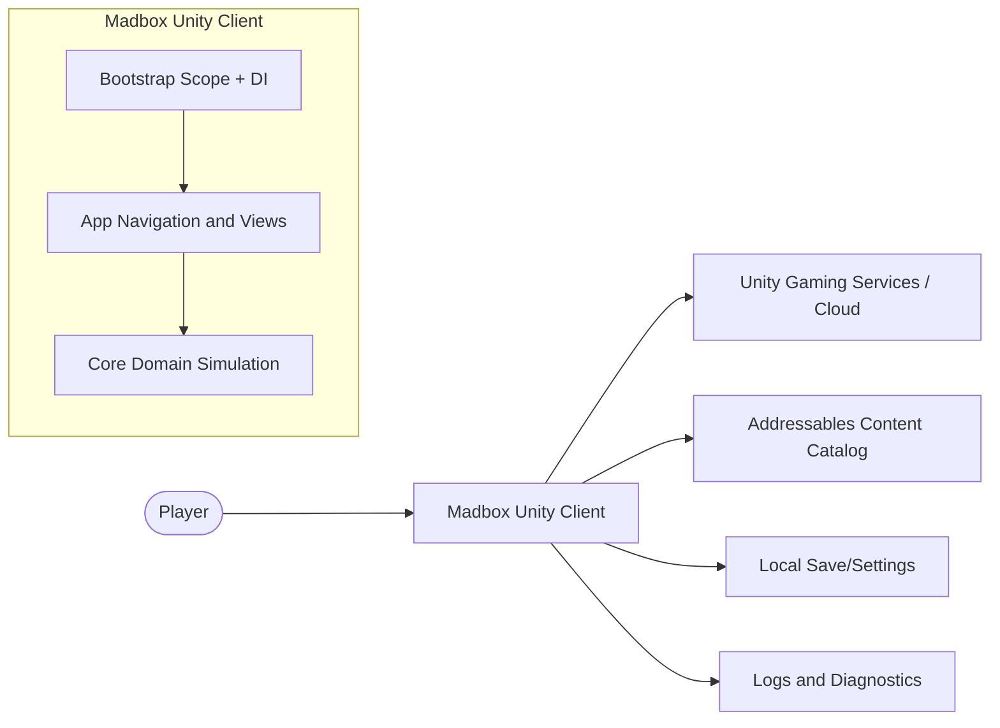
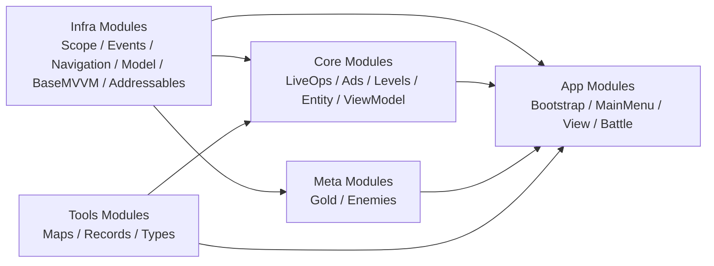
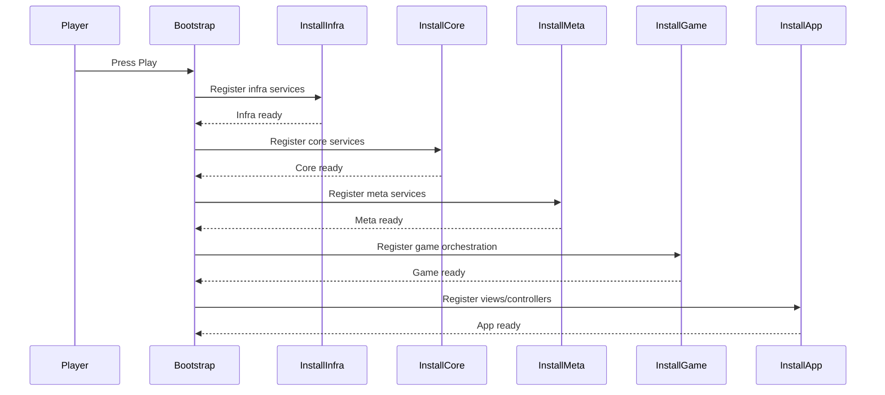
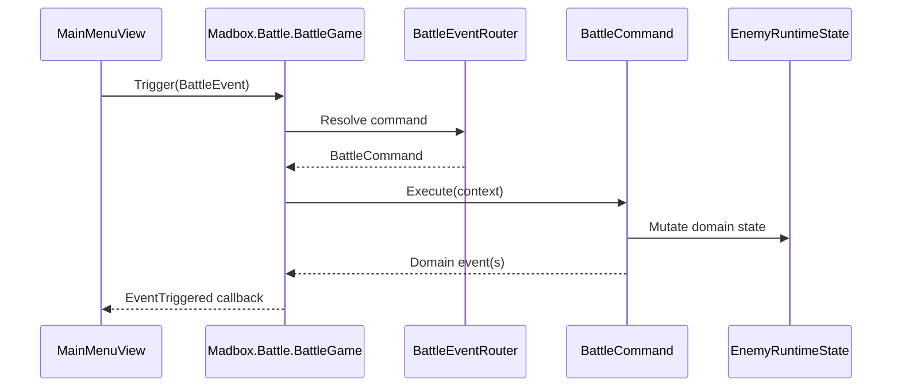
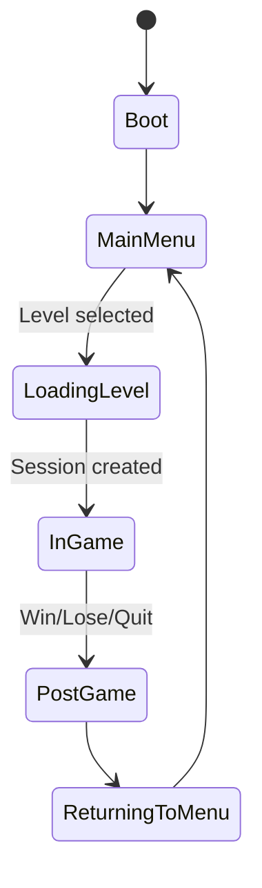

# Architecture

This document is the architecture entrypoint for Madbox. It describes the current module boundaries, runtime flow, and verification loop used to keep architecture rules enforceable.

## TL;DR

- Madbox is a modular Unity project with explicit assembly boundaries under `Assets/Scripts/`.
- Core gameplay logic is kept in pure C# modules; Unity-specific behavior stays in app/presentation layers.
- Architecture enforcement is layered: docs standards, `.asmdef` dependency boundaries, and custom Roslyn analyzers.
- Startup composition follows deterministic phases (`Infra -> Core -> Meta -> Game -> App`) aligned with research flows.
- Current state updated on 2026-03-18.

## Architectural Drivers

- Keep module boundaries explicit and mechanically enforceable.
- Preserve testability by isolating domain logic from Unity runtime concerns.
- Keep startup predictable and diagnosable with deterministic scope initialization.
- Make quality checks repeatable through repository scripts and analyzer diagnostics.

## Project Summary

Madbox is a modular Unity project with architecture controls enforced through:

- Documentation standards under `Docs/Standards/`.
- Explicit assembly boundaries under `Assets/Scripts/**/*.asmdef`.
- Custom Roslyn analyzers under `Analyzers/Scaffold/Scaffold.Analyzers`.
- Repository validation scripts under `.agents/scripts/`.

## Constraints and Invariants

- Core/domain assemblies must not depend on `UnityEngine` APIs.
- MonoBehaviour usage is restricted to bootstrap/app/presentation integrations.
- All cross-module dependencies must be declared in `.asmdef` files; no hidden references.
- Bootstrap/composition root owns concrete wiring; runtime modules consume contracts/interfaces.
- Any bug fix must include or update a regression test before completion.

## Tech Stack

- Engine: Unity `2022.3.50f1`
- Language: C#
- Architecture: MVVM
- Dependency Injection: VContainer (`jp.hadashikick.vcontainer`)
- Rendering: Universal Render Pipeline (URP)
- Core Packages: Addressables, AI Navigation, Cinemachine, TextMeshPro, Unity Test Framework, Scaffold Schemas (`com.scaffold.schemas`)
- Code Quality: Roslyn analyzers (`Analyzers/Scaffold/Scaffold.Analyzers`)

## System Context

Intent: show how external actors/systems interact with Madbox at runtime.
Source of truth: `Research/Layers and flow/Layers and flow.md`, `Research/Core-Loop/Core-Loop-Research-and-Specs.md`, `Assets/Scenes/Bootstrap.unity`, `Assets/Scenes/MainScene.unity`.
Update trigger: changes to startup sequence, external service integrations, or root scene flow.

System context diagram:

## Container/Module View

Intent: show static module groups and the allowed dependency direction between runtime containers.
Source of truth: `Assets/Scripts/**/*.asmdef`, `Madbox.sln`, `Research/Layers and flow/Layers and flow.md`.
Update trigger: add/rename/remove assemblies or change `.asmdef` references.

Container/module dependency diagram:

Current module documentation map:

- `Docs/App/Bootstrap.md`
- `Docs/App/Gameplay.md`
- `Docs/App/Battle.md`
- `Docs/App/GameView.md`
- `Docs/App/View.md`
- `Docs/Core/ViewModel.md`
- `Docs/Core/LiveOps.md`
- `Docs/Core/Ads.md`
- `Docs/Core/LiveOpsLevel.md`
- `Docs/Infra/Addressables.md`
- `Docs/Infra/BaseMVVM.md`
- `Docs/Infra/Events.md`
- `Docs/Infra/Model.md`
- `Docs/Infra/Navigation.md`
- `Docs/Infra/Scope.md`
- `Docs/Infra/SceneFlow.md`
- `Docs/Meta/Gold.md`
- `Docs/Meta/Enemies.md`
- `Docs/Tools/Maps.md`
- `Docs/Tools/Records.md`
- `Docs/Tools/Types.md`
- `Docs/Analyzers/Analyzers.md`
- `Docs/Testing.md`
- `Docs/AutomatedTesting.md`
- `Docs/Core/Levels.md`
- `Docs/Core/Entity.md`

## Runtime Flows

Intent: show critical runtime behavior for startup and gameplay lifecycle.
Source of truth: `Research/Layers and flow/Layers and flow.md`, `Research/Battle/Battle-Research-and-Specs.md`, `Research/Core-Loop/Core-Loop-Research-and-Specs.md`, `Assets/Scripts/App/Battle/Runtime/`.
Update trigger: any change to startup ordering, gameplay input pipeline, or navigation states.

Startup sequence:

Battle event flow sequence:

App loop state machine:

## Dependency Rules

Allowed:

- Explicit `.asmdef` references between modules.
- Pure C# domain logic in Core/Meta modules.
- Framework dependencies (`VContainer`, navigation/event adapters) in infra/bootstrap modules.

Forbidden:

- Hidden dependencies that bypass declared assembly references.
- Unity-facing runtime behavior inside pure domain modules.
- Direct production runtime coupling to analyzer implementation projects.

## Quality Attributes and Tradeoffs

- Modularity over convenience:
  - Pros: safer edits, stronger boundaries, analyzable dependency graph.
  - Tradeoff: more interfaces/contracts and composition wiring.
- Deterministic startup over implicit registration:
  - Pros: predictable initialization and easier fault isolation.
  - Tradeoff: phase ordering must be maintained intentionally.
- Domain authority over view authority:
  - Pros: testable and replayable game rules.
  - Tradeoff: adapter translation layers are required for Unity events/physics.
- Scripted validation over ad-hoc checks:
  - Pros: repeatable quality gate for contributors and agents.
  - Tradeoff: longer feedback loop than compile-only checks.

## Verification

Run from repository root:

- Full gate:
  - `& ".\.agents\scripts\validate-changes.cmd"`
- Analyzer diagnostics:
  - `powershell -NoProfile -ExecutionPolicy Bypass -File ".\.agents\scripts\check-analyzers.ps1"`
- EditMode tests:
  - `powershell -NoProfile -ExecutionPolicy Bypass -File ".\.agents\scripts\run-editmode-tests.ps1"`
- PlayMode tests:
  - `powershell -NoProfile -ExecutionPolicy Bypass -File ".\.agents\scripts\run-playmode-tests.ps1"`

Architecture controls and policy files:

- Analyzer source: `Analyzers/Scaffold/Scaffold.Analyzers`
- Analyzer tests: `Analyzers/Scaffold/Scaffold.Analyzers.Tests`
- Analyzer output: `Analyzers/Output/Scaffold.Analyzers.dll`
- Assembly boundaries: `Assets/Scripts/**/*.asmdef`
- Operational docs: `AGENTS.md`, `PLANS.md`, `MILESTONE.md`

## Operational policy

- Primary agent operating policy: `AGENTS.md`.
- ExecPlan authoring/execution policy: `PLANS.md`.
- Milestone plan policy: `MILESTONE.md`.
- Milestone quality gate is mandatory: `& ".\.agents\scripts\validate-changes.cmd"`.
- Analyzer diagnostics workflow: `.agents/workflows/check-analyzers.md`.
- Module creation workflow: `.agents/workflows/create-module.md`.
- Custom analyzer workflow: `.agents/workflows/create-custom-analyzer.md`.

## Change Log

- 2026-03-22: Moved `Madbox.Battle` from Core to App (`Assets/Scripts/App/Battle/`); updated module diagram and runtime source path.
- 2026-03-18: Reorganized the document to match architecture documentation standard; added system context, module dependency, startup/battle/runtime state diagrams, invariants, and quality-tradeoff sections.
- 2026-03-18: Synced docs map with current module docs and aligned startup/runtime language with research flow documents.
