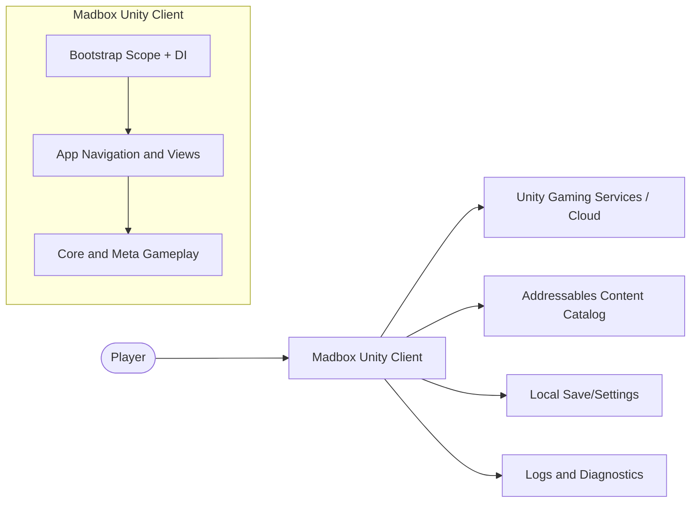
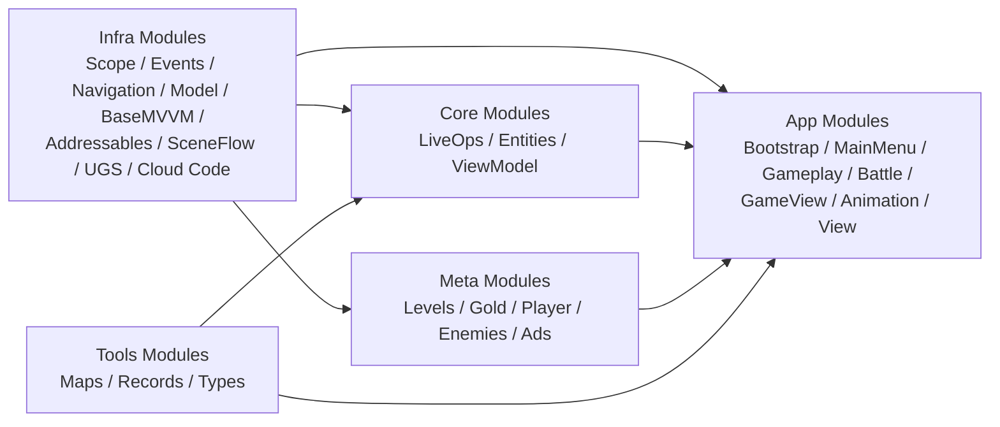
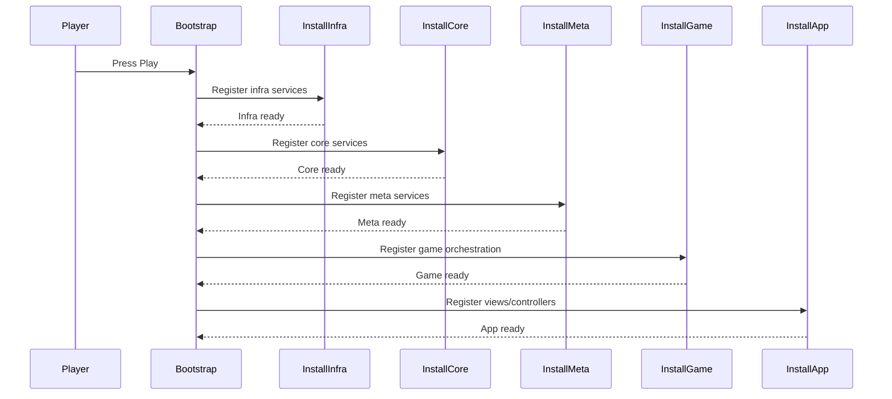
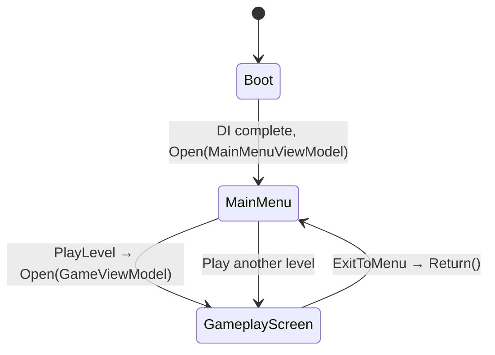

# Architecture

This document is the architecture entrypoint for Madbox. It describes the current module boundaries, runtime flow, and verification loop used to keep architecture rules enforceable.

**Sample project:** Madbox is a **finished sample** with **limited scope**; it is **not** expected to grow. It exists to **demonstrate** modular Unity architecture, MVVM-style UI, LiveOps integration, Addressables, Roslyn analyzers, and test workflows. Several splits and patterns exist to **show how boundaries and tooling work**, not because every choice is optimal for a minimal game. When this document references external services (UGS, CCD, Cloud Code), treat operational details as **illustrative**; verify against current Unity/UGS documentation for your environment.

## TL;DR

- Madbox is a modular Unity project with explicit assembly boundaries under `Assets/Scripts/`.
- The **`Core/`** script folder groups shared gameplay foundations; it is **not** a guarantee that every assembly under it is Unity-free. Some Core assemblies use `UnityEngine` on purpose (for example **`Madbox.Entities`**: ScriptableObjects, `MonoBehaviour` health and lifecycle hooks). Other modules may set `noEngineReferences: true` in `.asmdef` when they are intentionally engine-agnostic.
- UI and app-specific presentation stay in App/Infra; keep cross-module dependencies explicit and avoid leaking view concerns into unrelated modules.
- Architecture enforcement is layered: docs standards, `.asmdef` dependency boundaries, and custom Roslyn analyzers.
- Startup composition follows deterministic phases (`Infra -> Core -> Meta -> Game -> App`). After DI, **MainMenu** uses **meta services** (`ILevelService`, `IGoldService`) and **navigation** opens **GameViewModel** for a level; **GameView** drives **GameSessionCoordinator** (additive scene + **BattleGame**), then **Return** pops back to the menu.
- Current state reflects the repository.

## Architectural Drivers

- Keep module boundaries explicit and mechanically enforceable.
- Preserve testability: prefer plain C# and narrow surfaces where it helps; use EditMode tests without scenes when possible.
- Keep startup predictable and diagnosable with deterministic scope initialization.
- Make quality checks repeatable through repository scripts and analyzer diagnostics.

## Project Summary

Madbox is a modular Unity **sample** project (current feature set is **complete** for this repo) with architecture controls enforced through:

- Documentation standards under `Docs/Standards/`.
- Explicit assembly boundaries under `Assets/Scripts/**/*.asmdef`.
- Custom Roslyn analyzers under `Analyzers/Scaffold/Scaffold.Analyzers`.
- Repository validation scripts under `.agents/scripts/`.

## Constraints and Invariants

- **`Assets/Scripts/Core/` is a physical grouping, not “Unity-free by definition.”** Whether an assembly references `UnityEngine` is determined per `.asmdef` (for example `Madbox.Entities` uses the engine; some other assemblies use `noEngineReferences: true` where they stay agnostic).
- MonoBehaviour usage is allowed in Core when the module owns engine-facing gameplay building blocks (again, `Madbox.Entities` is the canonical example). Prefer keeping UI-specific MonoBehaviours in App/Infra presentation layers.
- All cross-module dependencies must be declared in `.asmdef` files; no hidden references.
- Bootstrap/composition root owns concrete wiring; runtime modules consume contracts/interfaces.
- Any bug fix must include or update a regression test before completion.

## Tech Stack

- Engine: Unity `2022.3.50f1`
- Language: C#
- Architecture: MVVM
- Dependency Injection: VContainer (`jp.hadashikick.vcontainer`)
- Rendering: Universal Render Pipeline (URP)
- Core Packages: Addressables, AI Navigation, Cinemachine, TextMeshPro, Unity Test Framework, Scaffold Schemas (`com.scaffold.schemas`)
- Code Quality: Roslyn analyzers (`Analyzers/Scaffold/Scaffold.Analyzers`)

## System Context

Intent: show how external actors/systems interact with Madbox at runtime.
Source of truth: `Research/Layers and flow/Layers and flow.md`, `Research/Core-Loop/Core-Loop-Research-and-Specs.md`, `Assets/Scenes/Bootstrap.unity`, `Assets/Scenes/MainScene.unity`.
Update trigger: changes to startup sequence, external service integrations, or root scene flow.

System context diagram:

```mermaid
flowchart LR
    Player([Player]) --> UnityClient[Madbox Unity Client]
    UnityClient --> UGS[Unity Gaming Services / Cloud]
    UnityClient --> Addressables[Addressables Content Catalog]
    UnityClient --> LocalData[Local Save/Settings]
    UnityClient --> Telemetry[Logs and Diagnostics]

    subgraph Client[Madbox Unity Client]
      Bootstrap[Bootstrap Scope + DI]
      AppFlow[App Navigation and Views]
      Domain[Core and Meta Gameplay]
      Bootstrap --> AppFlow
      AppFlow --> Domain
    end
```

## Container/Module View

Intent: show static module groups and the allowed dependency direction between runtime containers.
Source of truth: `Assets/Scripts/**/*.asmdef`, `Madbox.sln`, `Research/Layers and flow/Layers and flow.md`.
Update trigger: add/rename/remove assemblies or change `.asmdef` references.

Container/module dependency diagram:

```mermaid
flowchart LR
    Infra[Infra Modules<br/>Scope / Events / Navigation / Model / BaseMVVM /<br/>Addressables / SceneFlow / UGS / Cloud Code]
    Core[Core Modules<br/>LiveOps / Entities / ViewModel]
    Meta[Meta Modules<br/>Levels / Gold / Player / Enemies / Ads]
    App[App Modules<br/>Bootstrap / MainMenu / Gameplay / Battle /<br/>GameView / Animation / View]
    Tools[Tools Modules<br/>Maps / Records / Types]

    Infra --> Core
    Infra --> Meta
    Infra --> App
    Core --> App
    Meta --> App
    Tools --> Core
    Tools --> App
```

The diagram summarizes dependency **bands** only; exact `.asmdef` references are in each assembly definition.

### Module map

Runtime assemblies live under `Assets/Scripts/` unless noted. Paths point at the main **Runtime** root for each module. Companion `*Container` folders (same feature area) hold VContainer installers where present.

| Path | Assembly | One-liner |
|------|----------|-----------|
| **Infra** | | |
| `Assets/Scripts/Infra/Scope/Runtime/` | `Madbox.Scope` | Layered startup orchestration and installer pipeline composition. |
| `Assets/Scripts/Infra/Events/Runtime/` | `Scaffold.Events` | In-process typed event bus for decoupling modules. |
| `Assets/Scripts/Infra/Navigation/Runtime/` | `Scaffold.Navigation` | View-controller stack, transitions, and navigation configs. |
| `Assets/Scripts/Infra/Model/Runtime/` | `Scaffold.MVVM.Model` | Observable model base for MVVM state. |
| `Assets/Scripts/Infra/BaseMVVM/Runtime/` | `Scaffold.MVVM.Base` | Shared MVVM contracts (no Unity dependency). |
| `Assets/Scripts/Assets/Addressables/Runtime/` | `Madbox.Addressables` | Addressables load gateway and focused asset-loading APIs. |
| `Assets/Scripts/Infra/SceneFlow/Runtime/` | `Madbox.SceneFlow` | Additive Addressables scene load/unload while the bootstrap scene stays loaded. |
| `Assets/Scripts/Infra/Ugs/Runtime/` | `Madbox.Ugs` | UGS initialization and anonymous authentication. |
| `Assets/Scripts/Infra/CloudCode/Runtime/` | `Madbox.CloudCode` | Thin wrapper for Cloud Code module endpoints with JSON deserialization. |
| **Core** | | |
| `Assets/Scripts/Core/LiveOps/Runtime/` | `Madbox.LiveOps` | Typed LiveOps client, initial `GameData` fetch, and response dispatch. |
| `Assets/Scripts/Core/Entity/Runtime/` | `Madbox.Entities` | Entity attributes, behavior runners, and shared gameplay building blocks (uses Unity by design). |
| `Assets/Scripts/Core/ViewModel/Runtime/` | `Scaffold.MVVM.ViewModel` | ViewModel orchestration: binds, lifecycle, navigation-aware context. |
| **Meta** | | |
| `Assets/Scripts/Meta/Levels/Runtime/` | `Madbox.Levels` | Level authoring assets (`LevelDefinition`, rules, loadout) and LiveOps-backed menu availability (`LevelService`, `AvailableLevel`). |
| `Assets/Scripts/Meta/Gold/Runtime/` | `Madbox.Gold` | Minimal gold wallet model for meta currency. |
| `Assets/Scripts/Meta/Player/Runtime/` | `Madbox.Player` | Player entity, input/behavior types, and prefab-level hero wiring. |
| `Assets/Scripts/Meta/Enemies/Runtime/` | `Madbox.Enemies` | Enemy actors, spawning, and frame-evaluated AI behaviors. |
| `Assets/Scripts/Meta/Ads/Runtime/` | `Madbox.Ads` | Sample ads client module over LiveOps DTOs. |
| **App** | | |
| `Assets/Scripts/App/Bootstrap/Runtime/` | `Madbox.Bootstrap` | Composition root: layered installers and opening the first screen. |
| `Assets/Scripts/App/MainMenu/Runtime/` | `Madbox.MainMenu.Runtime` | Main menu MVVM slice (gold display, level buttons, start flow). |
| `Assets/Scripts/App/Gameplay/Runtime/` | `Madbox.Gameplay` | In-game screen: additive level load, battle session, win/lose return to menu. |
| `Assets/Scripts/App/Battle/Runtime/` | `Madbox.Battle` | Battle session from `LevelDefinition`: scene load, enemies, rule evaluation. |
| `Assets/Scripts/App/GameView/Runtime/` | `Madbox.GameView` | Player/enemy presentation helpers, arena markers, combat-oriented view behaviors. |
| `Assets/Scripts/App/Animation/Runtime/` | `Madbox.Animation` | Animator helpers and animation event routing. |
| `Assets/Scripts/App/View/Runtime/` | `Scaffold.MVVM.View` | Unity MVVM view layer (`View<T>`, binding, view events). |
| **Tools** | | |
| `Assets/Scripts/Tools/Maps/Runtime/` | `Scaffold.Maps` | Composite-key maps with predicate-based indexers. |
| `Assets/Scripts/Tools/Records/Runtime/` | `Scaffold.Records` | `IsExternalInit` compatibility shim for record-style types. |
| `Assets/Scripts/Tools/Types/Runtime/` | `Scaffold.Types` | Type metadata utilities (e.g. serialized type references) for configs and tooling. |

**Repository tooling (outside `Assets/Scripts` runtime):**

| Location | Role |
|----------|------|
| `Analyzers/Scaffold/Scaffold.Analyzers/` | Custom Roslyn analyzers (IDE/build-time only; not loaded by the Unity player). |
| `LiveOps/` | Cloud Code backend project and DTO packaging (see `Docs/LiveOps.md`). |

Current module documentation map:

- `Docs/App/Animation.md`
- `Docs/App/Battle.md`
- `Docs/App/Bootstrap.md`
- `Docs/App/GameView.md`
- `Docs/App/Gameplay.md`
- `Docs/App/MainMenu.md`
- `Docs/App/PlayerAttributes.md`
- `Docs/App/View.md`
- `Docs/Meta/Ads.md`
- `Docs/Core/Entities.md`
- `Docs/Meta/Levels.md`
- `Docs/Core/LiveOps.md`
- `Docs/Meta/LiveOpsLevel.md`
- `Docs/Core/ViewModel.md`
- `Docs/Assets/Addressables.md`
- `Docs/Infra/BaseMVVM.md`
- `Docs/Infra/Events.md`
- `Docs/Infra/Model.md`
- `Docs/Infra/Navigation.md`
- `Docs/Infra/SceneFlow.md`
- `Docs/Infra/Scope.md`
- `Docs/Meta/Enemies.md`
- `Docs/Meta/Gold.md`
- `Docs/Meta/Player.md`
- `Docs/Tools/Maps.md`
- `Docs/Tools/Records.md`
- `Docs/Tools/Types.md`
- `Docs/Analyzers/Analyzers.md`
- `Docs/LiveOps.md` (repo root `LiveOps/` layout and DTO build)
- `Docs/Guides/Upload-Addressables-CCD.md`, `Docs/Guides/Upload-LiveOps-Cloud-Code-Backend.md` (UGS: CCD upload, Cloud Code deployment)
- `Docs/Testing.md`
- `Docs/AutomatedTesting.md`
- `Docs/Standards/Module-Documentation-Standard.md`
- `Docs/Standards/Architecture-Documentation-Standard.md`

## Runtime Flows

Intent: show critical runtime behavior for startup, the main-menu-to-play path, and high-level navigation state.
Source of truth: `Assets/Scripts/App/Bootstrap/Runtime/BootstrapScope.cs`, `Assets/Scripts/App/MainMenu/Runtime/MainMenuViewModel.cs`, `Assets/Scripts/App/Gameplay/Runtime/GameViewModel.cs`, `Assets/Scripts/App/Gameplay/Runtime/GameView.cs`, `Assets/Scripts/App/Gameplay/Runtime/GameSessionCoordinator.cs`, `Assets/Scripts/App/Battle/Runtime/BattleGame.cs`, `Assets/Scripts/App/Battle/Runtime/BattleGameFactory.cs`.
Update trigger: any change to startup ordering, `INavigation` usage, session load/teardown, or `BattleGame` lifecycle.

After the DI registration sequence below, the **core play path** is: **MainMenu** binds to **`ILevelService`** / **`IGoldService`**, user picks a level → **`INavigation.Open(GameViewModel)`** → **`GameView`** starts **`GameSessionCoordinator.RunSessionAsync`** (additive Addressables scene + **`BattleGameFactory`** + **`BattleGame.Tick`** with rule handlers) → win/lose UI on **`SessionCompleted`** → **`ExitToMenu`** calls **`navigation.Return()`**. There is no battle event router, command objects, or separate “enemy runtime state” type in the current codebase.

### Startup sequence (DI registration)

```mermaid
sequenceDiagram
    participant Player
    participant Boot as Bootstrap
    participant Infra as InstallInfra
    participant Core as InstallCore
    participant Meta as InstallMeta
    participant Game as InstallGame
    participant App as InstallApp

    Player->>Boot: Press Play
    Boot->>Infra: Register infra services
    Infra-->>Boot: Infra ready
    Boot->>Core: Register core services
    Core-->>Boot: Core ready
    Boot->>Meta: Register meta services
    Meta-->>Boot: Meta ready
    Boot->>Game: Register game orchestration
    Game-->>Boot: Game ready
    Boot->>App: Register views/controllers
    App-->>Boot: App ready
```

### Main menu → gameplay session (services, navigation, battle)

```mermaid
sequenceDiagram
    participant Player
    participant MM as MainMenuViewModel
    participant Level as ILevelService
    participant Gold as IGoldService
    participant Nav as INavigation
    participant GVM as GameViewModel
    participant GV as GameView
    participant Coord as GameSessionCoordinator
    participant BG as BattleGame

    Note over MM,Gold: Initialize: wallet + AvailableLevels from LevelService
    Player->>MM: PlayLevel(availableLevel)
    MM->>Nav: Open(GameViewModel(levelDefinition), closeCurrent=false)
    Nav->>GVM: attach / show
    GV->>GVM: BeginSessionLoad
    GVM->>Coord: RunSessionAsync(level)
    Note over Coord,BG: Additive scene via ISceneFlowService; BattleGameFactory builds BattleGame
    loop While session running
        GV->>GVM: Tick(deltaTime)
        GVM->>Coord: Tick
        Coord->>BG: Tick (enemies + rule handlers)
    end
    BG-->>Coord: OnCompleted(gameEndOutcome)
    Coord-->>GVM: SessionCompleted
    GVM-->>GV: win/lose overlay
    Player->>GVM: ExitToMenu
    GVM->>Coord: TeardownSessionAsync
    GVM->>Nav: Return()
```

### App navigation and session lifecycle (high level)

`GameplayScreen` is one navigation screen: it may show a loading UI, then the level scene and **BattleGame**, then an end-state popup; returning to the menu is a **stack pop**, not a separate “loading level” app state.

```mermaid
stateDiagram-v2
    [*] --> Boot
    Boot --> MainMenu: DI complete, Open(MainMenuViewModel)
    MainMenu --> GameplayScreen: PlayLevel → Open(GameViewModel)
    GameplayScreen --> MainMenu: ExitToMenu → Return()
    MainMenu --> GameplayScreen: Play another level
```

## Dependency Rules

Allowed:

- Explicit `.asmdef` references between modules.
- Domain and gameplay logic in Core/Meta modules, with or without `UnityEngine` per assembly choice.
- Framework dependencies (`VContainer`, navigation/event adapters) in infra/bootstrap modules.

Forbidden:

- Hidden dependencies that bypass declared assembly references.
- Putting App/UI or scene-specific presentation concerns into modules that are not meant to own them (keep boundaries intentional).
- Direct production runtime coupling to analyzer implementation projects.

## Quality Attributes and Tradeoffs

- Modularity over convenience:
  - Pros: safer edits, stronger boundaries, analyzable dependency graph.
  - Tradeoff: more interfaces/contracts and composition wiring.
- Deterministic startup over implicit registration:
  - Pros: predictable initialization and easier fault isolation.
  - Tradeoff: phase ordering must be maintained intentionally.
- Clear module ownership over ad-hoc coupling:
  - Pros: testable contracts and predictable dependencies.
  - Tradeoff: adapter layers and explicit `.asmdef` edges when mixing engine and non-engine code.
- Scripted validation over ad-hoc checks:
  - Pros: repeatable quality gate for contributors and agents.
  - Tradeoff: longer feedback loop than compile-only checks.

## Verification

Run from repository root:

- Full gate:
  - `& ".\.agents\scripts\validate-changes.cmd"`
- Analyzer diagnostics:
  - `powershell -NoProfile -ExecutionPolicy Bypass -File ".\.agents\scripts\check-analyzers.ps1"`
- EditMode tests:
  - `powershell -NoProfile -ExecutionPolicy Bypass -File ".\.agents\scripts\run-editmode-tests.ps1"`
- PlayMode tests:
  - `powershell -NoProfile -ExecutionPolicy Bypass -File ".\.agents\scripts\run-playmode-tests.ps1"`

Architecture controls and policy files:

- Analyzer source: `Analyzers/Scaffold/Scaffold.Analyzers`
- Analyzer tests: `Analyzers/Scaffold/Scaffold.Analyzers.Tests`
- Analyzer output: `Analyzers/Output/Scaffold.Analyzers.dll`
- Assembly boundaries: `Assets/Scripts/**/*.asmdef`
- Operational docs: `AGENTS.md`, `PLANS.md`, `MILESTONE.md`

## Operational policy

- Primary agent operating policy: `AGENTS.md`.
- ExecPlan authoring/execution policy: `PLANS.md`.
- Milestone plan policy: `MILESTONE.md`.
- Milestone quality gate is mandatory: `& ".\.agents\scripts\validate-changes.cmd"`.
- Analyzer diagnostics workflow: `.agents/workflows/check-analyzers.md`.
- Module creation workflow: `.agents/workflows/create-module.md`.
- Custom analyzer workflow: `.agents/workflows/create-custom-analyzer.md`.

## Change Log

- Reorganized `Docs/` module paths to mirror `Assets/Scripts/` layout: Addressables under `Docs/Assets/`, Meta modules (`Ads`, `Levels`, `LiveOpsLevel`) under `Docs/Meta/`; updated the module documentation map accordingly.
- Replaced outdated **battle event** and **app loop** diagrams with flows matching **`MainMenuViewModel` → `GameViewModel` / `GameSessionCoordinator` → `BattleGame`**; updated Runtime Flows source-of-truth paths and TL;DR play-path summary.
- Added **Module map** (paths, assembly names, one-liners) and aligned the container band diagram with actual Infra/Core/Meta/App/Tools contents; noted finished-sample scope and non-goals of “demonstration-first” choices.
- Clarified **sample project** intent (limited scope, demonstrative tech choices); expanded `Docs/` map to match current module and guide files; pointed UGS operational details as environment-dependent.
- Documented that Core script folders may include Unity-engine references (notably `Madbox.Entities`); removed the outdated invariant that all Core/domain assemblies must be Unity-free.
- Moved `Madbox.Battle` from Core to App (`Assets/Scripts/App/Battle/`); updated module diagram and runtime source path.
- Reorganized the document to match architecture documentation standard; added system context, module dependency, startup/battle/runtime state diagrams, invariants, and quality-tradeoff sections.
- Synced docs map with current module docs and aligned startup/runtime language with research flow documents.
