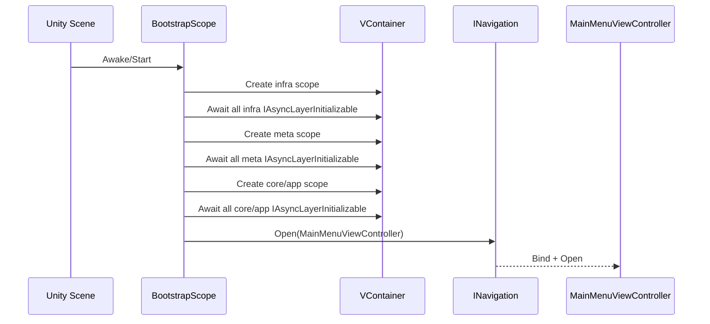

# Madbox App Bootstrap

## TL;DR

- Purpose: compose runtime scopes and open the first app screen.
- Location: `Assets/Scripts/App/Bootstrap/Runtime/`.
- Depends on: `Madbox.MainMenu.Runtime`, `Madbox.Level.Contracts`, `Madbox.Level.Runtime`, `Madbox.Gold.Contracts`, `Madbox.Gold.Runtime`, `Madbox.GameEngine.Contracts`, `Madbox.GameEngine.Runtime`, `Scaffold.Navigation`, `Scaffold.Navigation.Container`, `Scaffold.Events.Container`, `Scaffold.Scope`.
- Used by: scene startup.
- Runtime/Editor: runtime only.
- Keywords: bootstrap, composition root, vcontainer, startup flow.

## Responsibilities

- Implements project-specific bootstrap policy on top of Infra `LayeredScope`.
- Provides game/project-specific layer installers and startup configuration values.
- Does not own game rules, level progression, or UI rendering logic.
- Boundary: Unity-facing and composition-only module.

## Public API

| Symbol | Purpose | Inputs | Outputs | Failure behavior |
|---|---|---|---|---|
| `BootstrapScope` | Runtime composition root for this game/project | serialized scene fields + project-specific installer utilities | layer scopes initialized in order and first screen open | Startup fails on missing serialized references or initializer exceptions |

## Setup / Integration

1. Add `BootstrapScope` to the startup scene.
2. Assign navigation settings and `viewHolder` in inspector.
3. Ensure required assemblies are present in asmdef references (`Madbox.MainMenu.Runtime`, `Madbox.Level.Contracts`/`Runtime`, `Madbox.Gold.Contracts`/`Runtime`, `Madbox.GameEngine.Contracts`/`Runtime`, `Scaffold.Scope`, `Scaffold.Navigation`).
4. Press Play and confirm main menu opens only after layer initialization completes.

## How to Use

1. Keep `BootstrapScope` as the concrete project bootstrap derived from Infra `LayeredScope`.
2. Keep module registration separated by layer (infra -> meta -> core/app) and initialize each layer completely before the next.
3. Open initial screen through `INavigation` from bootstrap, not from random behaviors.

## Examples

### Runtime Startup Flow



## Best Practices

- Keep the reusable startup lifecycle in Infra Scope (`Scaffold.Scope`).
- Keep app-specific layer installers and first-screen behavior in `BootstrapScope`.
- Register only module-owned services per layer.
- Add new layers with one additional layer-initialization line in bootstrap startup orchestration.
- Fail fast on missing serialized configuration.
- Keep startup deterministic and idempotent.

## Anti-Patterns

- Opening screens directly from unrelated modules.
- Registering cross-module services in the wrong installer/scope.
- Putting business logic inside bootstrap lifecycle methods.

## Testing

- Test assemblies:
  - `Madbox.Bootstrap.Tests`
  - `Madbox.Bootstrap.PlayModeTests`
- Run from repo root:

```powershell
& ".\.agents\scripts\run-editmode-tests.ps1" -AssemblyNames "Madbox.Bootstrap.Tests"
& ".\.agents\scripts\run-playmode-tests.ps1" -AssemblyNames "Madbox.Bootstrap.PlayModeTests"
```

- Expected: all tests pass with zero failures.
- Bugfix rule: add/update regression test first, verify fail-before/fix/pass-after.

## AI Agent Context

- Invariants:
  - startup ordering remains infra -> meta -> core/app with awaited layer barriers.
  - first screen is opened through navigation, not direct view activation.
- Allowed Dependencies:
  - `Madbox.MainMenu.Runtime`, `Madbox.Level.Contracts`/`Runtime`, `Madbox.Gold.Contracts`/`Runtime`, `Madbox.GameEngine.Contracts`/`Runtime`, `Scaffold.Navigation`/`Container`, `Scaffold.Events.Container`, `Scaffold.Scope`, `VContainer`.
- Forbidden Dependencies:
  - gameplay rules and domain state mutation in bootstrap.
- Change Checklist:
  - verify startup still opens main menu.
  - verify scoped registrations remain module-owned.
  - run bootstrap tests.
- Known Tricky Areas:
  - scene serialization fields and startup null references.

## Related

- `Architecture.md`
- `Docs/App/MainMenu.md`
- `Docs/Testing.md`
- `Docs/Infra/Scope.md`

## Changelog

- 2026-03-15: Rewritten to AI-first standard with startup sequence diagram.

- 2026-03-16: Expanded bootstrap validation coverage for missing serialized fields (`navigationSettings`, `viewHolder`, `levelIds`) and valid configuration path.
- 2026-03-16: Added layer-serial async initialization barriers via `IAsyncLayerInitializable` and fail-fast startup behavior before opening Main Menu.
- 2026-03-16: Refactored Bootstrap to project-specific composition only; moved generic layered startup orchestration to `Scaffold.Scope`.
