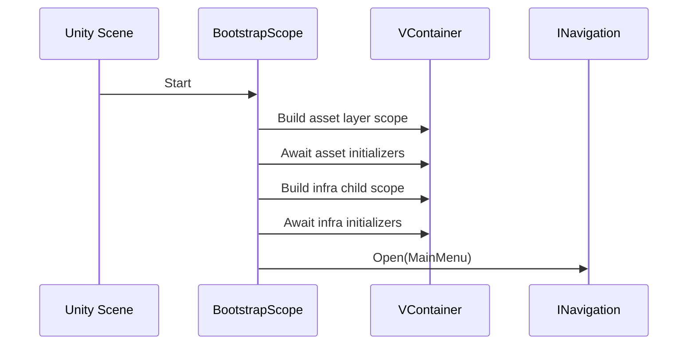

# Madbox App Bootstrap

## TL;DR

- Purpose: compose runtime scopes and open the first app screen.
- Location: `Assets/Scripts/App/Bootstrap/Runtime/`.
- Depends on: `Scaffold.Navigation`, `Scaffold.Navigation.Container`, `Scaffold.Events.Container`, `Madbox.Scope`, `Scaffold.MVVM.Model`, `Scaffold.MVVM.ViewModel`, `VContainer`, `Madbox.Addressables.Container`.
- Used by: scene startup.

## Responsibilities

- Implements project-specific bootstrap policy on top of Infra `LayeredScope`.
- Builds a single root installer tree (`asset -> infra`) through `BuildLayerTree()`.
- Opens the first screen only after startup finishes.

## Public API

| Symbol | Purpose | Inputs | Outputs | Failure behavior |
|---|---|---|---|---|
| `BootstrapScope` | Runtime composition root for this project. | Serialized scene fields + installer tree. | Final initialized scope and first screen open. | Throws on missing serialized references or startup failures. |
| `LoadingView` | Optional standalone transition loading UI (Show/Hide/IsVisible/SetProgress). | Scene placement; not registered in DI. | Visibility state. | Callers orchestrate when to show; not coupled to SceneFlow. |

## Setup / Integration

1. Add `BootstrapScope` to the startup scene.
2. Assign `navigationSettings` and `viewHolder` in inspector.
3. Ensure required asmdef references remain present.
4. Press Play and confirm main menu opens after startup completes.

## How to Use

1. Keep `BootstrapScope` as the concrete `LayeredScope` implementation.
2. Build tree in `BuildLayerTree()` and keep it deterministic.
3. Open initial screen through `INavigation` from `OnBootstrapCompleted(...)`.

## Examples

### Minimal

```csharp
// Scene contains BootstrapScope; Play invokes layered build then opens first navigation target
```

### Realistic


```mermaid
sequenceDiagram
  participant Scene as Unity Scene
  participant Boot as BootstrapScope
  participant DI as VContainer
  participant Nav as INavigation

  Scene->>Boot: Start
  Boot->>DI: Build asset layer scope
  Boot->>DI: Await asset initializers
  Boot->>DI: Build infra child scope
  Boot->>DI: Await infra initializers
  Boot->>Nav: Open(MainMenu)
```

### Guard / Error path

```csharp
// Missing navigationSettings or viewHolder reference: BootstrapScope throws during startup — assign in Inspector
```

## Best Practices

- Keep reusable startup behavior in `Madbox.Scope`.
- Keep project-specific composition in bootstrap installers.
- Keep startup deterministic and idempotent.
- Fail fast on missing serialized configuration.

## Anti-Patterns

- Registering feature services in the wrong layer scope — breaks initializer ordering and cross-layer resolution.
- Opening gameplay scenes without `INavigation` — bypasses view/controller lifecycle.

## Testing

- Test assemblies:
  - `Madbox.Bootstrap.Tests`
  - `Madbox.Bootstrap.PlayModeTests`
- Run from repo root:

```powershell
& ".\.agents\scripts\run-editmode-tests.ps1" -AssemblyNames "Madbox.Bootstrap.Tests"
& ".\.agents\scripts\run-playmode-tests.ps1" -AssemblyNames "Madbox.Bootstrap.PlayModeTests"
```

- Expected: all tests pass, zero failures.
- Bugfix rule: add/update regression test first.

## AI Agent Context

- Invariants: single installer tree from `BuildLayerTree()`; first screen only after async startup completes.
- Allowed Dependencies: Navigation, Events, Scope, MVVM, Addressables container, VContainer.
- Forbidden Dependencies: Feature gameplay types in `Bootstrap` runtime asmdef beyond composition needs.
- Change Checklist: run EditMode + PlayMode bootstrap tests after installer edits; sync `Docs/Infra/Scope.md`.
- Known Tricky Areas: asset vs infra layer ordering; optional `LoadingView` not in DI.

## Related

- `Architecture.md`
- `Docs/Testing.md`
- `Docs/Infra/Scope.md`

## Changelog

- 2025-03-23: Aligned with module documentation standard (Examples subsections, Anti-Patterns, AI Agent Context).
- Prior: Added `LoadingView`; single-tree `LayerInstallerBase`; asset-first `BootstrapAssetInstaller`; generic orchestration in `Madbox.Scope`.
