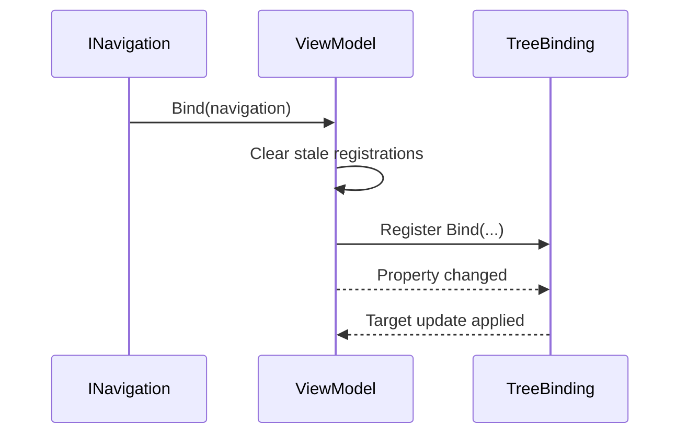

# Scaffold.MVVM.ViewModel

## TL;DR

- Purpose: MVVM orchestration layer for bind registration, lifecycle reset, and navigation-aware context.
- Location: `Assets/Scripts/Core/ViewModel/`.
- Depends on: `Scaffold.MVVM.Base`, `Scaffold.Navigation`, `Scaffold.Maps`, `Scaffold.Records`.
- Used by: `Scaffold.MVVM.View` and app presentation controllers.
- Runtime/Editor: runtime + EditMode tests.

## Responsibilities

- Owns `IViewModel` and `ViewModel` contracts (under `Runtime/Contracts/` and runtime implementation).
- Owns binding contracts/implementations (`IBindedProperty`, `IBindedCollection`, `TreeBinding`, `BindingOptions`, related abstractions).
- Owns bind lifecycle entry (`Bind(INavigation)`) and stale-binding cleanup behavior.
- Does not own Unity `MonoBehaviour` view concerns.

## Public API

| Symbol | Purpose | Inputs | Outputs | Failure behavior |
|---|---|---|---|---|
| `IViewModel` | MVVM controller contract | navigation/context bind calls | standardized controller lifecycle | invalid consumer assumptions can break runtime behavior |
| `ViewModel` | Base implementation with binding orchestration | `Bind(INavigation)` + binding registrations | initialized state + binding graph | stale registrations are cleared on rebind |
| `BindingOptions` | Binding strict/lazy behavior configuration | option flags (e.g., `Lazy`) | runtime binding evaluation mode | strict mode throws on unresolved paths |
| `IBindedProperty<,>` / `IBindedCollection<,>` | Disposable binding handle contracts | bind registration return values | per-binding disposal semantics | disposing detaches only the owning registration |
| `TreeBinding` and contracts | Binding registration/update engine | source expressions + targets | update propagation graph | unresolved strict paths can throw |

## Setup / Integration

1. Add references to `Scaffold.MVVM.ViewModel` and `Scaffold.Navigation`.
2. Inherit screen controllers from `ViewModel`.
3. Call `Bind(INavigation)` at controller startup/bind entry.
4. Register bindings in `Initialize()` or equivalent bind lifecycle methods.

Common setup mistakes:
- Skipping `Bind(INavigation)` lifecycle entry.
- Holding stale handles across rebinds.

Fast checks:
- Rebinding should clear old registrations before new initialization.
- Module tests should pass with no binding lifecycle regressions.

## How to Use

1. Define state in `Model` descendants and expose through `ViewModel`.
2. Register binds with MVVM bind APIs.
3. Use `BindingOptions.Lazy` only when deferred/null-path-safe behavior is required.
4. Dispose individual binding handles only when partial teardown is needed.

## Examples

### Minimal

```csharp
public partial class InventoryViewModel : ViewModel
{
    [ObservableProperty] private InventoryModel model = new InventoryModel();
    [ObservableProperty] private int value;

    protected override void Initialize()
    {
        Bind(() => model.Value, () => Value);
    }
}
```

### Realistic



### Guard / Error path

```csharp
// Rebind-safe pattern: rely on framework cleanup at Bind(navigation).
public void OnNavigationContextChanged(INavigation navigation)
{
    Bind(navigation);
}
```

## Best Practices

- Treat `Bind(INavigation)` as the lifecycle reset point.
- Keep binding expressions explicit and stable.
- Use lazy bindings intentionally, not by default.
- Keep domain logic in models/services, not in glue binding code.
- Prefer framework bind APIs over manual property notification wiring.

## Anti-Patterns

- Manual `PropertyChanged` subscribe/unsubscribe in MVVM descendants.
- Calling `OnPropertyChanged(...)` manually where bind APIs should be used.
- Keeping disposed/invalid binding handles and reusing them after rebind.

## Testing

- Test assembly: `Scaffold.MVVM.ViewModel.Tests`.
- Run:

```powershell
& ".\.agents\scripts\run-editmode-tests.ps1" -AssemblyNames "Scaffold.MVVM.ViewModel.Tests"
```

- Expected: all tests pass, zero failures.
- Bugfix rule: add/update regression test first, verify fail-before/fix/pass-after.

## AI Agent Context

- Invariants:
  - `Bind(INavigation)` clears stale bindings before re-initialization.
  - per-binding disposal affects only that registration.
  - strict vs lazy binding behavior remains explicit and test-covered.
- Allowed Dependencies:
  - `Scaffold.MVVM.Model`, `Scaffold.Navigation`, `Scaffold.Maps`, `Scaffold.Records`.
- Forbidden Dependencies:
  - Unity view lifecycle classes (`MonoBehaviour` view concerns).
- Change Checklist:
  - verify `Scaffold.MVVM.ViewModel.Tests` passes.
  - verify rebind behavior still clears stale registrations.
  - verify lazy/strict behavior and handle disposal paths.
- Known Tricky Areas:
  - deferred access chains with `BindingOptions.Lazy`.
  - nested model replacement across active bindings.

## Related

- `Architecture.md`
- `Docs/Infra/Model.md`
- `Docs/App/View.md`
- `Docs/Infra/Navigation.md`

## Changelog

- 2026-03-15: Added split module file.
- 2026-03-15: Reorganized from legacy combined MVVM doc and expanded to module standard.

- 2026-03-16: Added coverage for close-without-navigation behavior and repeated bind initialization flow.
- 2026-03-17: Consolidated `Scaffold.MVVM.ViewModel.Contracts` into `Scaffold.MVVM.ViewModel` and moved boundary types to `Runtime/Contracts/`.
