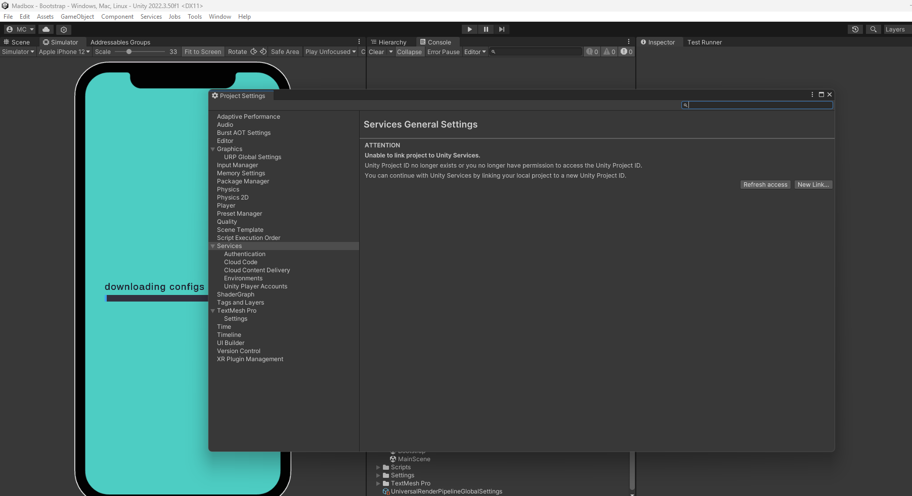
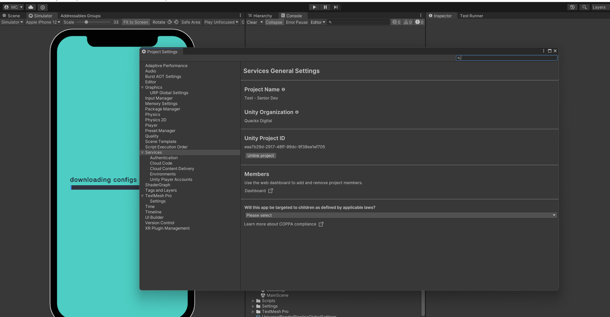
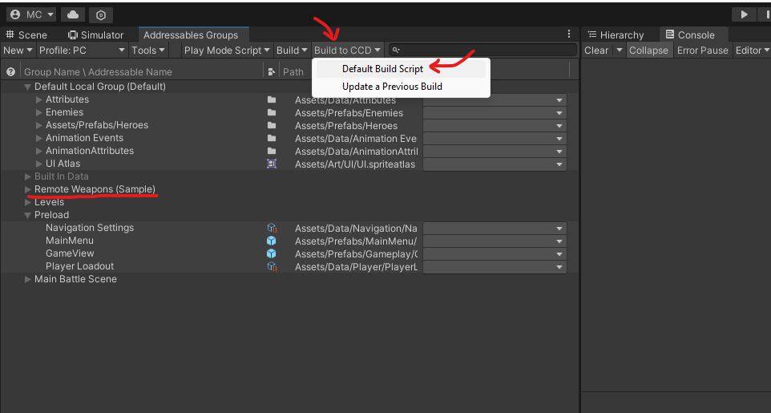
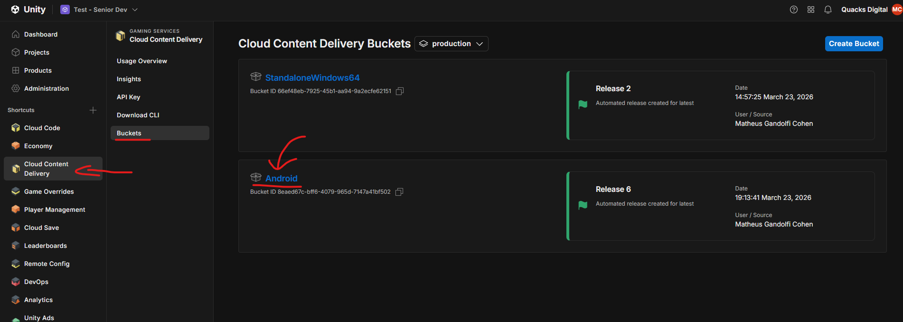
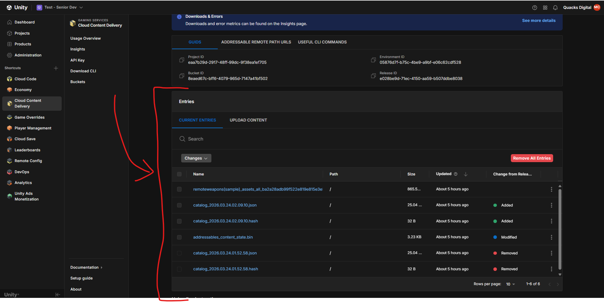

# Upload Addressables to Cloud Content Delivery (CCD)

## TL;DR

- Purpose: Upload **Addressables** builds to **Unity Gaming Services (UGS) Cloud Content Delivery (CCD)** from the Unity Editor and verify releases in the dashboard.
- Location: This guide in `Docs/Guides/`; Editor **Window > Asset Management > Addressables**.
- Depends on: Unity project linked to Unity Dashboard when uploading; Addressables + CCD profile configured.
- Used by: Content pipelines; separate from Cloud Code — see [Upload the LiveOps Cloud Code backend](Upload-LiveOps-Cloud-Code-Backend.md).
- Runtime/Editor: Editor build/upload; runtime loads remote catalog per `Docs/Assets/Addressables.md`.

Keywords: Addressables, CCD, UGS, remote catalog, Build to CCD

## Responsibilities

- Owns: When linking is required, **Build to CCD** flow, dashboard verification, clarification that upload completes in-Editor.
- Does not own: LiveOps Cloud Code deployment, or custom bucket policies beyond standard UGS linking.
- Boundaries: Sample workflow; Unity menu names may vary slightly by Editor version.

## Public API

| Artifact / action | Purpose |
|---|---|
| `Build to CCD` (Addressables Groups) | Builds and publishes content to CCD buckets for the linked project. |
| Unity Dashboard → **Cloud Content Delivery** | Verify buckets, releases, and files. |
| Addressables **PC** profile (this sample) | Sample uses **PC** profile for all target platforms when uploading here. |

## Setup / Integration

1. For **upload only**: link the Editor to Unity Services (**Edit > Project Settings > Services**) with a valid Unity Project ID.
2. Open **Addressables Groups** (**Window > Asset Management > Addressables > Groups**).
3. Read the **Disclaimer** subsection below before relying on uploads.

## How to Use

### 1. Disclaimer: running the project vs. uploading content

Read this block before the rest of the guide.

| Situation | What you need |
|-----------|----------------|
| **Run the project as it is already set up** | Open the Unity Editor and use the project normally. **You do not need** Unity Gaming Services linked, dashboard access, or deploy permissions just to open the repo and run the game. |
| **Build new Addressables, edit remote content, or upload to CCD** | **You do need** a Unity account that can link this Editor project to a **Unity Dashboard** project and deploy to your target environment. Follow the steps below and this guide’s upload flow—**no extra custom account settings** beyond that. |

**Project is ready for your own Unity project:** You are not required to use someone else’s org or a specially configured account. **Create your own Unity Dashboard project** (or use one you already control), **link your Unity account** to that project in **Edit > Project Settings > Services**, then upload Addressables **as defined in this guide**. That standard link-and-upload path is enough; the pipeline does not depend on bespoke organization policies or unusual UGS configuration.

**If you try to upload without a valid link**, the Editor shows an error like **Unable to link project to Unity Services** (see screenshot). That only blocks **upload / CCD build** flows—not opening the project or running locally.

---

### 2. Unity project link (required only for uploads)

The following applies when you are **building to CCD** or otherwise need Unity Services for this repo—not for simply running the game.

#### When linking fails (you cannot upload yet)

Open **Edit > Project Settings**, select **Services** in the left list, then **Services** (general). If you see **ATTENTION** and **Unable to link project to Unity Services** (project ID missing, revoked, or no permission), fix this **before** using **Build to CCD** or any upload step in this guide.

**What to do**

- **Refresh access** if your permissions were updated recently.
- **New Link...** to associate this local project with a **Unity Dashboard** project you own or can access (a valid **Unity Project ID**).
- If the ID no longer exists or you lack access, ask a **Dashboard** admin to add you to the project.

#### When linking works (uploads can proceed)

**Services General Settings** lists your **Unity Organization**, **Unity Project ID**, and **Unlink project**—not the error above.

Under **Services**, you should also see **Cloud Content Delivery**. If you still see the error state, do not continue with CCD uploads until it is resolved.

---

### 3. Build Addressables to CCD from the Editor

1. Open the **Addressables Groups** window (**Window > Asset Management > Addressables > Groups**, or your project’s equivalent).
2. In the Addressables Groups toolbar, set **Profile** to **PC**. This sample’s Addressables profile is already configured so that **PC** is the correct choice for **all target platforms** (you do not need to switch profiles per Android, iOS, or standalone when uploading to CCD here).
3. In the Addressables Groups toolbar, open **Build** (or the **Build to CCD** flow, depending on package version).
4. Choose **Build to CCD** and run the build script your project uses (for example **Default Build Script**), as shown below.

5. Wait for the build and upload to finish; fix any reported Addressables or authentication errors and repeat.

---

### 4. Confirm content in the Unity Dashboard (CCD buckets)

1. Sign in to the [Unity Dashboard](https://dashboard.unity3d.com/) and open your project.
2. Go to **Cloud Content Delivery** and open **Buckets** for the right **environment** (for example **production**).
3. You should see platform buckets (for example **Android**, **StandaloneWindows64**) and **releases** created when content was uploaded.

4. Open a bucket to inspect **releases** and files for the platform you care about.

---

### 5. Build to CCD already completes the upload

When **Build to CCD** finishes successfully, the Addressables content is **already published** to **Cloud Content Delivery** for this project’s buckets and environment. There is no separate “confirm upload” or second step in the Editor required for the files to reach CCD.

---

### 6. No manual upload to the dashboard

You do **not** need to upload Addressables bundles, catalogs, or loose files by hand through the Unity Dashboard (for example drag-and-drop into buckets or a manual “upload release” flow outside the Editor). **Build to CCD** is the full pipeline for this sample. The dashboard steps in **section 4** are only for **verification**—checking that a release appears after a build—not for duplicating or replacing what the Editor already did.

## Examples

### Minimal

Use **Build to CCD** from Addressables Groups after the project is linked and the profile is set to **PC**.

### Realistic

Follow **How to Use** §2–§4: fix Services link if needed → **Build to CCD** → verify buckets/releases in the **Dashboard**.

### Guard / Error path

Upload attempts while **Services** shows **Unable to link project to Unity Services** — fix linking first; running the game locally does not require linking.

## Best Practices

- Use the sample **PC** profile for CCD uploads here (do not switch per platform for this sample).
- Treat dashboard steps as **verification** only after a successful build.

## Anti-Patterns

- Manually re-uploading the same content through the dashboard when **Build to CCD** already succeeded.
- Expecting local play to require UGS linking — it does not for this repo.

## Testing

- After changing Addressables or remote paths, run the repository gate: `.\.agents\scripts\validate-changes.cmd` (see `Docs/Testing.md`).
- PlayMode/EditMode tests do not replace validating a real CCD release in your environment.

## AI Agent Context

- Invariants: **Build to CCD** is the canonical upload path for this sample; dashboard is read-only verification.
- Allowed Dependencies: Unity/UGS documentation for CCD and Addressables; `Docs/Assets/Addressables.md` for runtime gateway behavior.
- Forbidden Dependencies: N/A (procedural doc).
- Change Checklist: update screenshots if Unity UI moves; keep disclaimer about running without UGS link.
- Known Tricky Areas: private vs public buckets; `Addressables.WebRequestOverride` for private buckets (see Unity docs).

## Related

- Unity: [Cloud Content Delivery](https://docs.unity.com/ugs/en-us/manual/cloud-content-delivery/manual/introduction)
- [Upload the LiveOps Cloud Code backend](Upload-LiveOps-Cloud-Code-Backend.md) — Cloud Code (logic), separate from CCD (content)
- `Docs/Assets/Addressables.md`
- `Docs/Testing.md`

## Changelog

- 2025-03-23: Restructured to `Module-Documentation-Standard.md` (full section order; preserved procedural body under **How to Use**).
