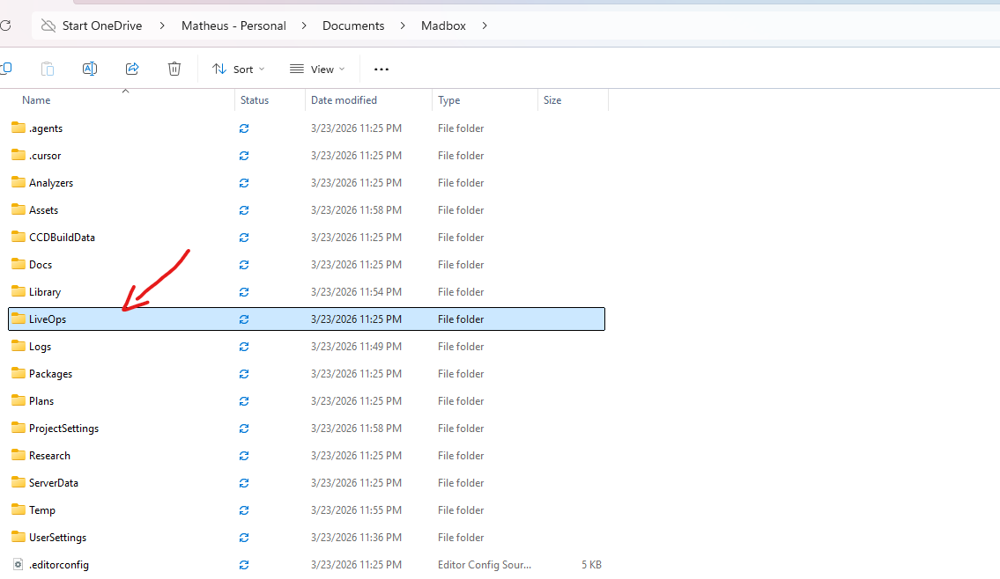
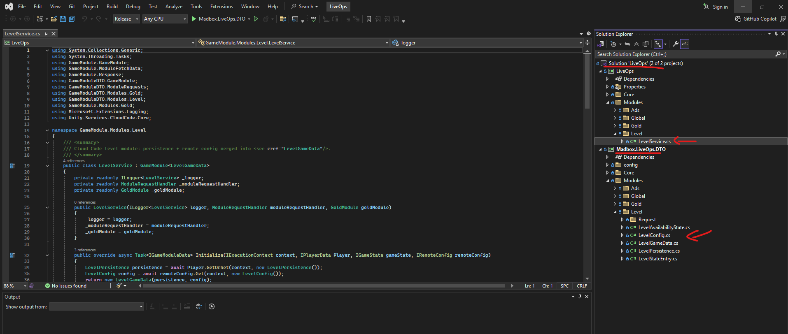
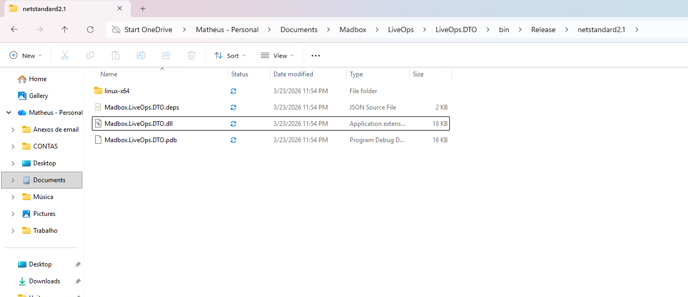
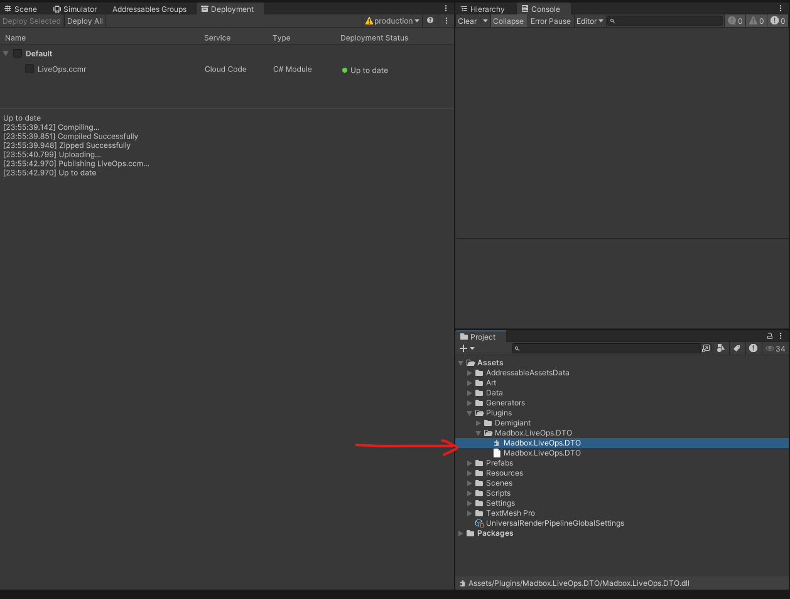
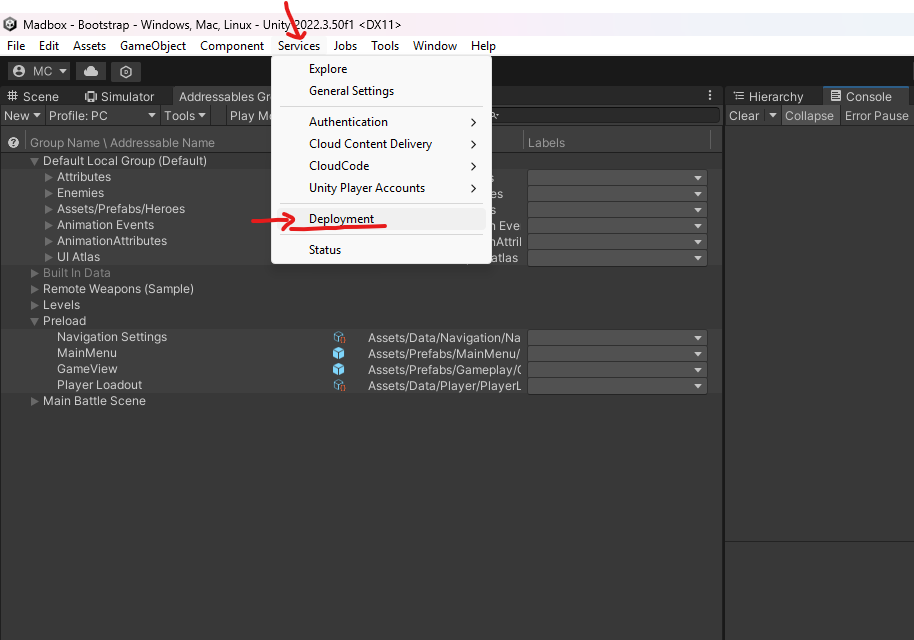
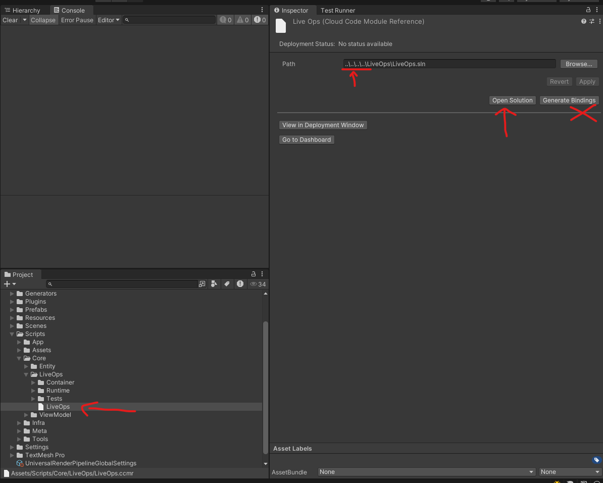
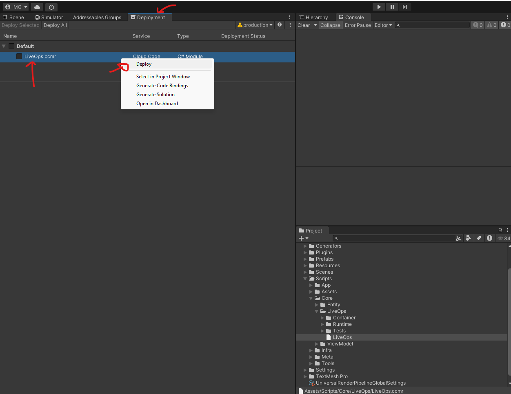
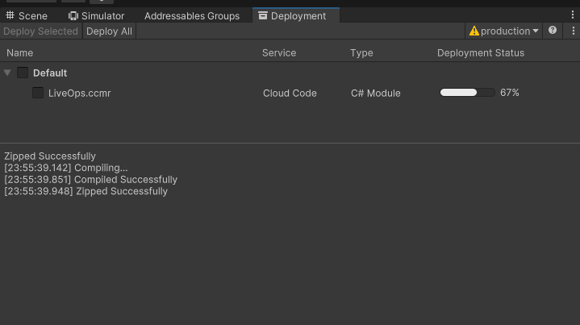
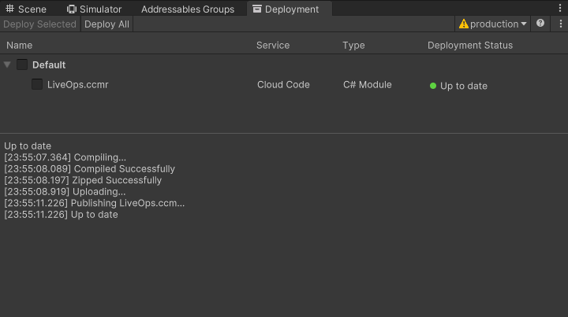

# Upload the LiveOps Cloud Code backend (UGS)

## TL;DR

- Purpose: Deploy the **Madbox LiveOps** Cloud Code backend from the Unity Editor and understand which repo files matter (`LiveOps/`, `.ccmr`, DTO plugin).
- Location: This guide under `Docs/Guides/`; server sources under `LiveOps/` at repo root.
- Depends on: UGS-linked Editor project, `com.unity.services.deployment`, `com.unity.services.cloudcode`, .NET SDK for local builds.
- Used by: Backend/deploy tasks; client behavior remains `Docs/Core/LiveOps.md`.
- Runtime/Editor: Editor deployment workflow; verify menu names against your Unity version.

Keywords: Cloud Code, UGS, Deployment, LiveOps, CCMR, DTO

## Responsibilities

- Owns: Step-by-step Editor deployment, path table, DTO copy, `.ccmr` verification, sanity checks.
- Does not own: Addressables/CCD uploads — see [Upload Addressables to CCD](Upload-Addressables-CCD.md). Build one-liners also in [LiveOps (repo root)](../LiveOps.md).
- Boundaries: Sample workflow; confirm against current Unity/UGS documentation for your org.

## Public API

| Artifact | Purpose | Notes |
|---|---|---|
| `LiveOps/LiveOps.sln` | Build server + DTO | `dotnet build -c Release` |
| `Assets/Scripts/Core/LiveOps/LiveOps.ccmr` | Cloud Code Module Reference for Deployment | Points at LiveOps solution |
| `Assets/Plugins/Madbox.LiveOps.DTO/Madbox.LiveOps.DTO.dll` | Client/server shared contracts | Copy after DTO changes |

## Setup / Integration

1. Link Unity project to a Unity Dashboard project when deploying (**Edit > Project Settings > Services**).
2. Confirm packages in `Packages/manifest.json`: `com.unity.services.deployment`, `com.unity.services.cloudcode`.
3. Set **Edit > Preferences > Cloud Code** .NET path on Windows if prompted.
4. Read [Disclaimer](#disclaimer-running-the-project-vs-uploading-content) before deploying.

## How to Use

### Disclaimer: running the project vs. uploading content

Read this block before the rest of the guide.

| Situation | What you need |
|-----------|----------------|
| **Run the project as it is already set up** | Open the Unity Editor and use the project normally. **You do not need** Unity Gaming Services linked, dashboard access, or deploy permissions just to open the repo and run the game. |
| **Build, edit server code, or deploy Cloud Code** | **You do need** a Unity account that can link this Editor project to a **Unity Dashboard** project and deploy to your target **environment**. Follow the steps in this guide—**no extra custom account settings** beyond that. |

**Project is ready for your own Unity project:** You are not required to use someone else’s org or a specially configured account. **Create your own Unity Dashboard project** (or use one you already control), **link your Unity account** to that project in **Edit > Project Settings > Services**, then deploy the backend **as defined in this guide**. That standard link-and-deploy path is enough; the pipeline does not depend on bespoke organization policies or unusual UGS configuration.

**If you try to deploy without a valid link**, the Editor shows an error like **Unable to link project to Unity Services** (screenshots under [Prerequisites](#3-prerequisites-before-you-deploy)). That only blocks **Cloud Code deployment**—not opening the project or running locally.

---

### 1. Cloud Code deploy, the Unity player, and the DTO boundary

**Changing the service does nothing until you deploy.** Editing **`LiveOps/`** locally or adjusting Cloud Code in the **Unity Dashboard** does **not** change what runs in UGS or what your client hits until you **deploy** the module from the Unity Editor (**Services > Deployment**). There is no automatic propagation: **upload first**, then you can observe new server behavior. Until then, **nothing changes** in the deployed environment.

**Unity does not depend on the LiveOps project sources.** The Unity player does **not** compile or load the `LiveOps/` folder. If Unity needs anything from that solution, it is **only** through the shared **DTO** assembly: build output **`Madbox.LiveOps.DTO.dll`**, copied into **`Assets/Plugins/Madbox.LiveOps.DTO/`**. You **build** the LiveOps solution, **take the DTO DLL**, and **copy** it into that plugin path when contracts change.

**Practical effect:** You can change server code and DTO projects under `LiveOps/` as much as you like; **Unity runtime is unaffected** until you drop in a **new DTO DLL** (and you deploy Cloud Code when you want the **server** to match). The Editor does not “see” LiveOps except via that DLL and via **deployment** of the backend—**not** by sharing source folders.

---

### 2. Know the important paths

| What | Path |
|------|------|
| **Backend solution** | `LiveOps/LiveOps.sln` |
| **DTO (shared contracts)** | `LiveOps/LiveOps.DTO/` → build output `Madbox.LiveOps.DTO.dll` |
| **Cloud Code host project** | `LiveOps/Project/` → main output assembly **`LiveOps.dll`** (assembly name matches the deployed module identity) |
| **Unity Cloud Code module reference (CCMR)** | `Assets/Scripts/Core/LiveOps/LiveOps.ccmr` |
| **DTO plugin copied into Unity** | `Assets/Plugins/Madbox.LiveOps.DTO/Madbox.LiveOps.DTO.dll` |

The **`.ccmr`** file (Cloud Code **C# Module Reference**) tells the Unity **Deployment** package which **solution** to build and deploy. This project points at the LiveOps solution:

```1:3:Assets/Scripts/Core/LiveOps/LiveOps.ccmr
{
  "modulePath": "..\\..\\..\\..\\LiveOps\\LiveOps.sln"
}
```

**Module name:** client requests use the Cloud Code module name **`LiveOps`** (see shared DTO base `ModuleRequest` in `LiveOps/LiveOps.DTO/`). The name configured in UGS for this deployment should stay aligned with that string.

### Where the backend lives in the repo

The **LiveOps** solution sits next to the Unity project at the repository root.





**DLL output locations (after a Release build)** — confirm exact folders in your local build output if paths differ:





---

### 3. Prerequisites (before you deploy)

### Unity project link (required only for deployment)

Use your Unity Dashboard project / Unity Project ID so the Editor can deploy to the right place. See **Disclaimer: running the project vs. uploading content** at the top of this guide for when linking matters.

**If linking fails (you cannot deploy yet):** open **Edit > Project Settings**, select **Services** (general). If you see **ATTENTION** and **Unable to link project to Unity Services**, fix linking before deploying.


**What to do:** **Refresh access** if permissions changed; **New Link...** to bind this project to a **Unity Dashboard** project you can access; ask a **Dashboard** admin if you lack access.

When linking works, you should see organization, project ID, and **Unlink project** — not the error state above.


Under **Services**, you should also see **Cloud Code** (and **Environments**, etc.).

### Packages and tooling

1. **Packages** (already listed in `Packages/manifest.json` for this repo):  
   - `com.unity.services.deployment`  
   - `com.unity.services.cloudcode`  

2. **.NET SDK** installed on the machine, and the Editor knows where `dotnet` lives for Cloud Code builds:  
   - **Windows:** **Edit > Preferences > Cloud Code** (set the .NET path if Unity prompts you).

3. **Optional but recommended:** build locally so you catch compile errors before upload:

   ```powershell
   dotnet build "LiveOps\LiveOps.sln" -c Release
   ```

---

### 4. Sync the DTO plugin (client stays in sync with contracts)

After a **Release** build, refresh the DLL Unity references:

- Copy  
  `LiveOps\LiveOps.DTO\bin\Release\netstandard2.1\Madbox.LiveOps.DTO.dll`  
  →  
  `Assets\Plugins\Madbox.LiveOps.DTO\Madbox.LiveOps.DTO.dll`

See [LiveOps (repo root)](../LiveOps.md) for the one-liner. Deploying Cloud Code does **not** replace this step; the game client still needs the matching plugin for typed DTOs.

---

### 5. Open the Deployment window

Unity **2022.3** (this project’s version): use the top menu **Services > Deployment**.

- In **2021.3 and earlier**, the path is **Window > Deployment** (or **Window > Gaming Services > Deployment**, depending on package version).



---

### 6. Choose the target environment

1. In the **Deployment** window, open **Deployment Settings** / environment UI (as offered by your package version).  
2. Pick the **environment** (for example development vs production) where this module should run.  
3. Confirm you are not deploying to the wrong environment by mistake.

---

### 7. Verify the Cloud Code module reference (.ccmr)

1. In the **Project** window, select **`Assets/Scripts/Core/LiveOps/LiveOps.ccmr`**.  
2. In the **Inspector**, confirm **Solution Path** / **module path** resolves to **`LiveOps/LiveOps.sln`** (relative paths are stored; they should still point at the repo’s LiveOps solution).  
3. In the **Deployment** window, the same asset should appear as a deployable **Cloud Code** item once the project is linked and packages are loaded.



**Note:** “CCMR” here means **Cloud Code Module Reference** (the `.ccmr` asset), not “CRM.”

### Do not use **Generate Bindings**

The screenshot marks **Generate Bindings** for a reason: **this project does not use Unity’s automatically generated Cloud Code bindings.** Ignore that button for this workflow.

**How we talk to LiveOps instead:** the client uses **`ModuleRequest`** and **`ModuleResponse`** types (and related DTOs) defined in the **`LiveOps.DTO`** project (`LiveOps/LiveOps.DTO/`), built into **`Madbox.LiveOps.DTO.dll`**. When you need a new contract, you add or change the request and response types **in that DTO project**, **build** the solution, **export** **`Madbox.LiveOps.DTO.dll`**, and **copy** it into **`Assets/Plugins/Madbox.LiveOps.DTO/`** so Unity sees the updated types.

**Why:** we keep **full control** over how contracts are shaped, what helpers exist, and how the client calls Cloud Code. Unity-generated bindings do not give you that control in a straightforward way (if at all), so this repo standardizes on **hand-authored DTOs** plus normal C# usage—not generated binding glue.

---

### 8. Deploy the backend

1. Open **Services > Deployment**.  
2. Select the **`LiveOps.ccmr`** entry (or select it in the Project window, then use **Deploy Selected** in the Deployment window).  
3. Click **Deploy Selected** (or **Deploy All** if you intend to push every listed asset).  
4. Watch the **status** / log area for success or errors. Fix compile errors in `LiveOps/` and retry.







Optional: use **Open in Dashboard** from the context menu to verify the module in **Unity Dashboard > Cloud Code**.

Unity’s Deployment package defaults to a **Release**-style build for the solution; keep test-only projects out of the publish path if you add more projects to the solution.

Official references: [Deployment window](https://docs.unity3d.com/Packages/com.unity.services.deployment@1.7/manual/deployment_window.html), [Cloud Code modules in the Editor](https://docs.unity.com/ugs/en-us/manual/cloud-code/manual/modules/how-to-guides/write-modules/unity-editor).

---

### 9. After deployment: quick sanity checks

1. **Dashboard:** In the Unity Dashboard, open **Cloud Code** for your project and confirm a module named consistently with **`LiveOps`** (and the environment you chose).  
2. **Client:** Run the game with UGS initialized; **`LiveOpsService`** issues requests whose module name comes from **`ModuleRequest.ModuleName`** (`"LiveOps"` by default in `LiveOps/LiveOps.DTO`).  
3. If something fails at runtime, verify authentication / environment / and that the DTO plugin matches the deployed backend.

---

## Examples

### Minimal

```powershell
dotnet build "LiveOps\LiveOps.sln" -c Release
```

### Realistic

Follow **How to Use** §3–§9: link Services → sync DTO → **Services > Deployment** → deploy `LiveOps.ccmr` → dashboard sanity check.

### Guard / Error path

Deploying without fixing **Services** link errors — deployment is blocked until the project links to a valid Unity Dashboard project (see screenshots in §3).

## Best Practices

- Build `LiveOps.sln` locally before deploy to catch compile errors early.
- Pick the correct **environment** in the Deployment window before pushing.
- Keep hand-authored DTO workflow — do **not** use **Generate Bindings** for this repo (see §7).

## Anti-Patterns

- Expecting server changes to apply without deploying from the Editor.
- Forgetting to copy `Madbox.LiveOps.DTO.dll` after contract edits.
- Deploying to production under the wrong environment selection.

## Testing

- After backend or DTO changes affecting the client, run the repository gate from the repo root:

```text
.\.agents\scripts\validate-changes.cmd
```

- See [Testing](../Testing.md) for script behavior and exit codes.
- Expected: gate passes with `0` when Unity compiles and tests succeed.
- Bugfix rule: server contract bugs need DTO alignment **and** client regression tests when behavior changes.

## AI Agent Context

- Invariants: Unity does not compile `LiveOps/` sources; client uses DTO DLL + Cloud Code module name **`LiveOps`**; `.ccmr` must reference `LiveOps/LiveOps.sln`.
- Allowed Dependencies: Official Unity/UGS docs for menu names; this guide’s paths for this repo layout.
- Forbidden Dependencies: N/A (procedural doc).
- Change Checklist: update screenshots paths if Unity moves menus; cross-check `Docs/LiveOps.md` and `Docs/Core/LiveOps.md`.
- Known Tricky Areas: **Generate Bindings** must stay unused; environment mismatch between deploy and client.

## Related

- [Upload Addressables to CCD](Upload-Addressables-CCD.md)
- [LiveOps (repo root)](../LiveOps.md)
- [Core LiveOps](../Core/LiveOps.md)
- [Testing](../Testing.md)
- Unity: [Deployment window](https://docs.unity3d.com/Packages/com.unity.services.deployment@1.7/manual/deployment_window.html)
- Unity: [Cloud Code modules in the Editor](https://docs.unity.com/ugs/en-us/manual/cloud-code/manual/modules/how-to-guides/write-modules/unity-editor)

## Changelog

- 2025-03-23: Restructured to `Module-Documentation-Standard.md` (added TL;DR through Changelog; numbered steps moved under **How to Use**).
