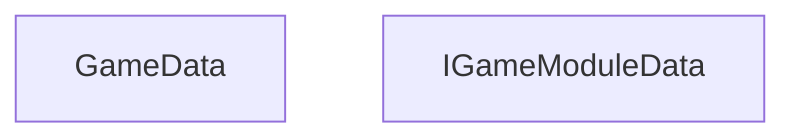

<!-- hash: 5389363dc3d41febf207fec4ac401d99 -->
# GameModule Documentation

This document details the purpose and relations of the components in `/GameModuleDTO/Core/GameModule`.

## Component Overview

### `GameData` (class)
- **Description**: Acts as a central container holding multiple game module configurations. The main goal is to aggregate configuration instances for network transmission.
- **Namespace**: `GameModuleDTO.GameModule`
- **Methods**: `AddModuleData`, `GetModules`, `AddModules`

### `IGameModuleData` (interface)
- **Description**: Contract for module payloads stored and transmitted with Cloud Save / responses.
- **Namespace**: `GameModuleDTO.GameModule`
- **Properties**: `Key` (each concrete DTO uses `Key => typeof(ThatType).Name`, aligned with Cloud Save / cache keys)

## Dependency & Behavior Schema

[Back to Parent](../CoreRead.md)
