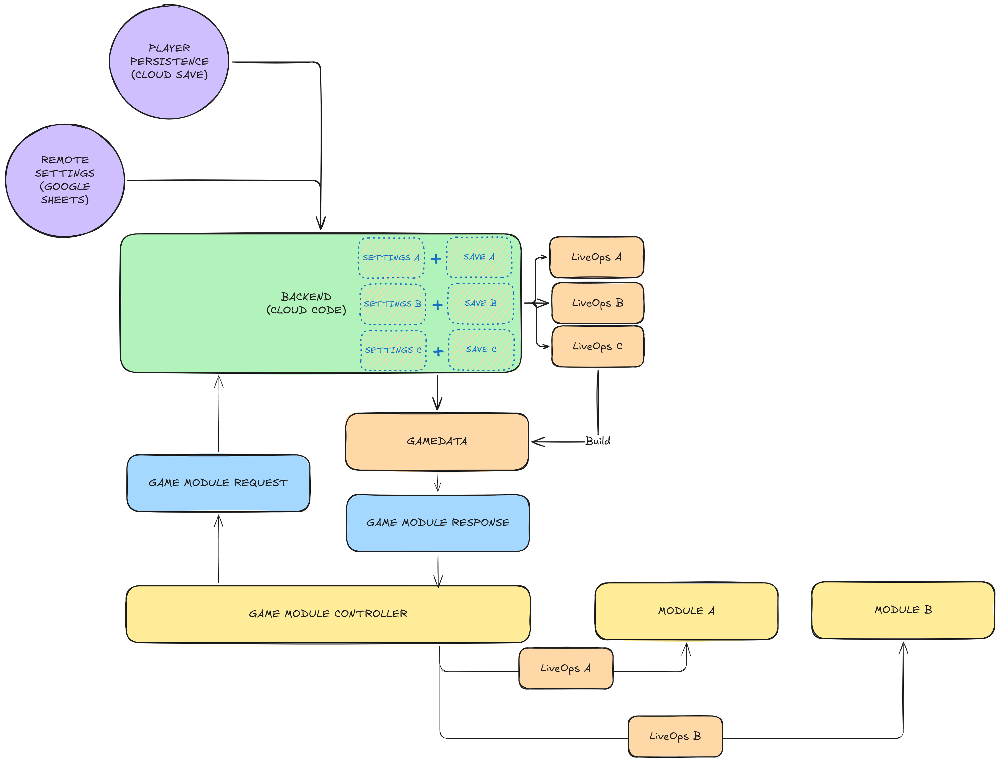
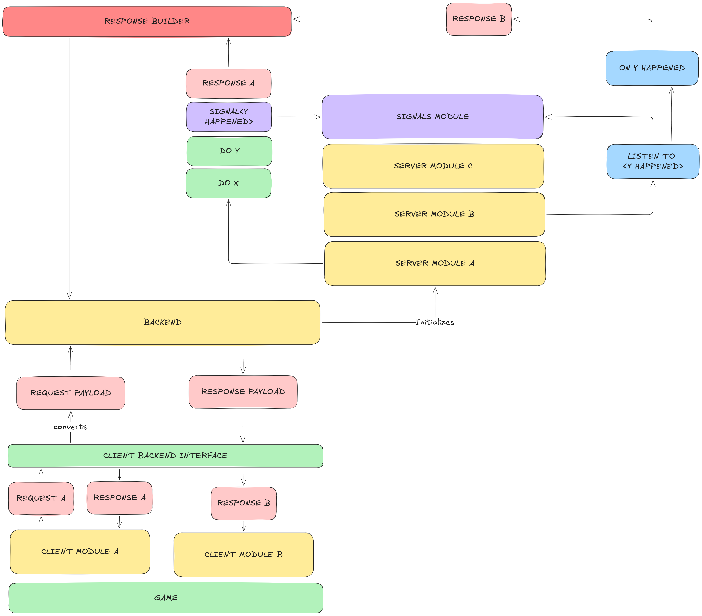
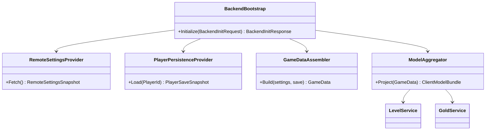
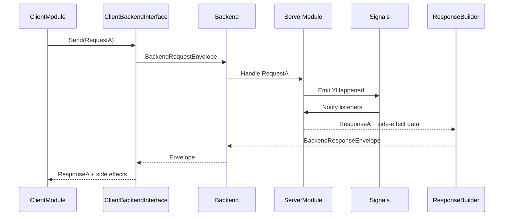

# Backend Research and Specs

Date: 2026-03-17
Scope: Backend initialization and unified request/response flow based on `Research/backend-initialization.png` and `Research/backend-request-flow.png`




Related documents:

1. `Research/Entities/Entity-Research-and-Specs.md`
2. `Research/Entities/Entity-Addressables-Specs.md`
3. `Research/Battle/Battle-Research-and-Specs.md`
4. `Research/Core-Loop/Core-Loop-Research-and-Specs.md`

## 1. Understanding from the Diagrams

The backend design has two connected concerns:

1. Initialization pipeline:
   - Backend reads remote settings and player persistence.
   - Backend merges both into a unified domain model (`GameData`).
   - `GameData` plus live-ops rules produce per-module data consumed by module services/controllers.
2. Request pipeline:
   - Game modules send typed requests through a client-backend interface.
   - Backend processes through server modules and signals module.
   - Backend returns typed direct response and may also emit reactive side-effect responses triggered by domain signals.

Main interpretation:

1. Backend is the composition root for remote config + save state.
2. Client modules should not call remote config or cloud save directly.
3. Side effects are first-class outputs of backend processing, not ad-hoc callbacks.

## 2. Core Principles

1. Single source of truth: backend-owned `GameData` model after initialization.
2. Deterministic merge policy between remote settings and player persistence.
3. Unified request contract across all client modules.
4. Response model supports:
   - direct response for the request, and
   - reactive side-effect responses generated by backend signals.
5. Module isolation:
   - client modules depend on backend interface, not backend internals.
6. Backend modules communicate through explicit signals/events, not hidden coupling.
7. Entire backend logic should be runnable in pure C# tests.

## 3. Initialization Flow (Proposed)

1. Client starts app/session and invokes backend initialization.
2. Backend fetches:
   - remote settings (for example, Google Sheets snapshot),
   - player persistence/cloud save snapshot.
3. Backend validates schema/version compatibility.
4. Backend applies merge strategy into domain `GameData`.
5. LiveOps modules derive feature-specific projections from `GameData`.
6. Backend returns initialization payload to client aggregator.
7. Client aggregator feeds module services (for example, `LevelService`, `GoldService`).

## 4. Unified Request Flow (Proposed)

1. Client module creates typed request (`Request<TResponse>`).
2. Client backend interface converts to backend payload and dispatches.
3. Backend routes request to responsible server module(s).
4. Server module may emit domain signal(s) (`YHappened`).
5. Signals module notifies subscribers; listeners may create additional effects.
6. Response builder composes:
   - primary response (`ResponseA`),
   - side-effect responses (`ResponseB`, etc.).
7. Client receives unified response envelope.
8. Module-specific client handlers apply direct result and side-effect updates.

## 5. Data and Contract Shapes

### 5.1 Initialization Contracts

1. `BackendInitRequest`
   - app version, player id/session id, optional last-known data version.
2. `BackendInitResponse`
   - unified `GameData`,
   - module projections/version tokens,
   - optional initialization side effects.

### 5.2 Runtime Request Contracts

1. `BackendRequestEnvelope`
   - request id, timestamp, module key, request payload.
2. `BackendResponseEnvelope`
   - request id correlation,
   - direct typed response payload,
   - list of side-effect payloads,
   - optional model delta/version token.

### 5.3 Side-Effect Contract

1. Side effects must be typed and explicit (`GoldChanged`, `OfferUnlocked`, `LevelUnlocked`).
2. Side effects are append-only outputs for a request execution, ordered by backend commit sequence.
3. Client must be able to process side effects idempotently using event ids/version.

## 6. Sample UML

### 6.1 Initialization Architecture



### 6.2 Unified Request + Side-Effects



## 7. Sample Interfaces (Draft)

```csharp
public interface IBackendClient
{
    Task<BackendInitResponse> InitializeAsync(BackendInitRequest request, CancellationToken ct);
    Task<BackendResponseEnvelope> SendAsync(BackendRequestEnvelope request, CancellationToken ct);
}

public interface IBackendInitializer
{
    Task<GameData> BuildInitialGameDataAsync(BackendInitRequest request, CancellationToken ct);
}

public interface IGameDataAssembler
{
    GameData Build(RemoteSettingsSnapshot settings, PlayerSaveSnapshot save);
}

public interface IModelAggregator
{
    ClientModelBundle Project(GameData data);
}

public interface IRequestRouter
{
    BackendResponseEnvelope Route(BackendRequestEnvelope request, BackendContext context);
}

public interface ISignalBus
{
    void Publish<TSignal>(TSignal signal) where TSignal : IBackendSignal;
    IDisposable Subscribe<TSignal>(Action<TSignal> handler) where TSignal : IBackendSignal;
}

public interface IResponseBuilder
{
    BackendResponseEnvelope Build<TResponse>(
        RequestId requestId,
        TResponse primaryResponse,
        IReadOnlyList<ISideEffectPayload> sideEffects,
        ModelDelta? delta);
}
```

## 8. Error Handling and Consistency Rules

1. Initialization fails fast if required snapshots are missing or invalid.
2. Every response must include request correlation id.
3. Side effects should only be emitted after successful backend state mutation.
4. If request processing fails:
   - return typed error response,
   - no partial side-effect envelope unless explicitly marked compensating.
5. Include data/model version token so client can detect stale updates.

## 9. Concerns and Things to Explore

1. Merge precedence:
   - when remote setting conflicts with save value, which wins?
2. Offline strategy:
   - how to bootstrap when remote settings are temporarily unavailable.
3. Retries and dedup:
   - idempotency keys for request replay safety.
4. Signal storms:
   - bounded side-effect output and batching strategy.
5. Contract evolution:
   - versioning for request/response payload schemas.
6. Observability:
   - structured logs for request path, emitted signals, and response envelope.
7. Security:
   - validation/sanitization of client request payloads before module execution.
8. Latency:
   - synchronous vs deferred side-effect generation trade-offs.

## 10. Suggested Next Iteration

1. Define concrete envelope DTOs (`BackendRequestEnvelope`, `BackendResponseEnvelope`).
2. Define first signal + side-effect set (`GoldChanged`, `LevelUnlocked`).
3. Implement initializer prototype that merges remote settings + save into `GameData`.
4. Implement one vertical slice request (`ClaimRewardRequest`) through full unified path.
5. Add pure C# tests for:
   - initialization merge rules,
   - direct response + side-effect response composition,
   - idempotent replay behavior.
