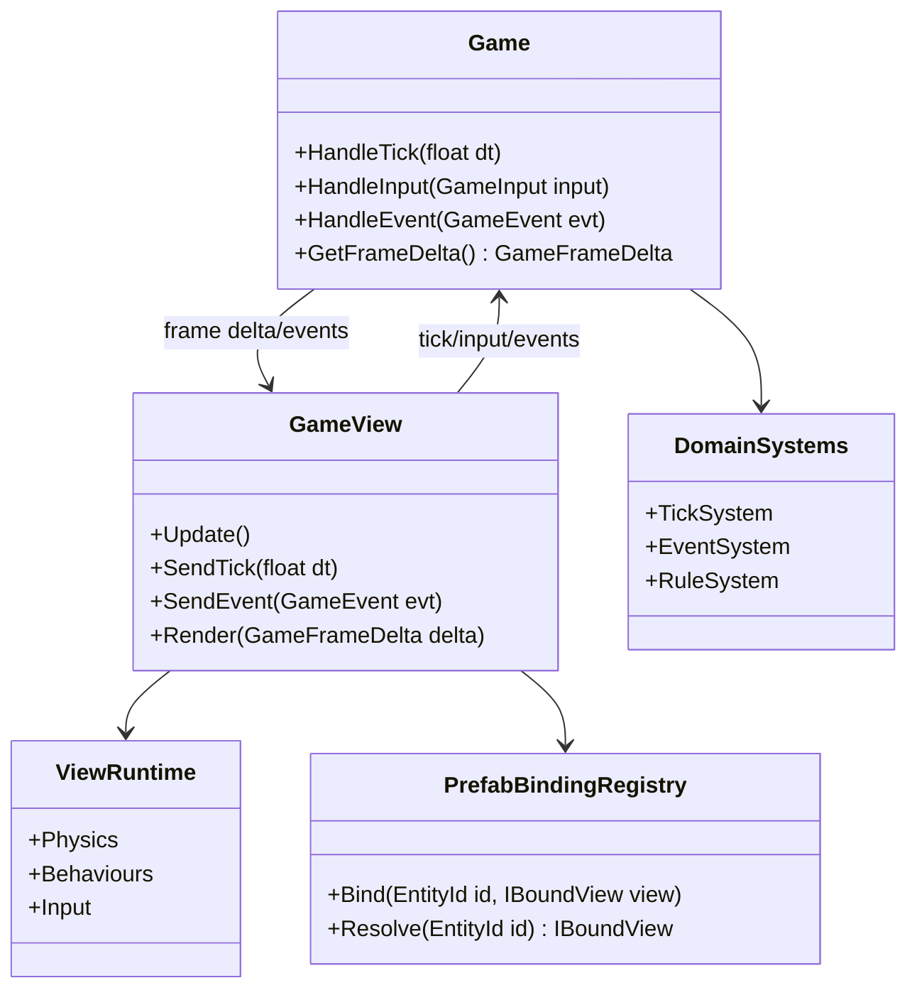
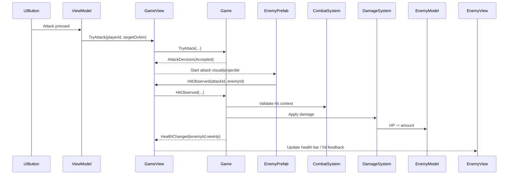

# Battle Research and Specs

Date: 2026-03-17
Scope: Battle runtime architecture boundaries, based on `Research/Battle/battle architecture.png`


## 1. Understanding from the Battle Image

The diagram splits the runtime into two sides:

1. `GAME` (full C# domain simulation and rules).
2. `GAME VIEW` (Unity runtime integration, physics, behaviours, input).

Key relationships shown:

1. A game engine/boot layer creates `GAME` and opens `GAME VIEW`.
2. `GAME VIEW` is injected/bound to `GAME`.
3. Domain systems run on the C# side (tick, events, rules).
4. Unity systems run on the view side (physics, behaviours, input).
5. Factories exist on both sides to instantiate domain objects and matching prefabs.

## 2. Core Principles (This Implementation)

1. `GameView` drives simulation time by sending `Tick(deltaTime)` input to `Game`.
2. `GameView` controls pause/resume by deciding whether to send tick deltas.
3. `Game` owns all gameplay truth and applies updates through deterministic systems.
4. Runtime collisions/contacts become explicit domain events (example: `Damage(from,to,amount)`).
5. Prefab instances bind to model/entity ids; views render current model state (health, death, etc.).
6. The game remains runnable in pure C# without Unity by feeding events/inputs (`Tick`, `Damage`, `Kill`, etc.).
7. Movement presentation can remain view-local for now and does not require domain event replication.
8. Domain does not model animation-transient events (for example, no required `AttackStarted` visual event).
9. Player attack flow should use a validation contract (`TryAttack` -> `AttackDecision`) so authority stays in domain.

## 3. Runtime Contract

### 3.1 Input From View to Game

1. `Tick(deltaTime)` each frame while not paused.
2. Player commands (if any) normalized as domain inputs.
3. Collision-driven gameplay intents as domain events:
   - Example: enemy prefab touches player -> `Damage(from,to,amount)`.
4. Preferred attack input:
   - `TryAttack(actorId, targetOrAim, time)` from ViewModel to domain.
5. Optional hit reporting (if collision stays view-side):
   - `HitObserved(attackId, targetId, contactData)` from view runtime to domain.

### 3.2 Output From Game to View

1. Entity/model snapshots or frame deltas keyed by entity id.
2. Domain events needed for presentation (died, hit, spawned, despawned).
3. Read-only state consumed by view binders for health bars, animations, FX.
4. Attack authorization result:
   - `AttackDecision(Accepted|Rejected, reason?, attackPayload?)`

### 3.3 Authority Rules

1. `Game` validates and applies events.
2. `GameView` never mutates domain models directly.
3. View physics may detect contact, but only `Game` decides final state change.
4. View may start visuals only after domain accepts the attack intent.

## 4. Flow Proposal (Unity + Pure C# Modes)

### 4.1 Unity Runtime Mode

1. Bootstrap creates domain `Game`.
2. Bootstrap creates `GameView` and binds it to `Game`.
3. Per frame, `GameView` emits `Tick(deltaTime)` when not paused.
4. UI/ViewModel sends `TryAttack` and receives `AttackDecision`.
5. If accepted, view starts animation/projectile visuals.
6. Physics/behaviour callbacks in prefabs may generate `HitObserved`.
7. `Game` processes inputs/events, updates systems, emits state changes.
8. Bound prefab presenters consume changes and update visuals.

### 4.2 Pure C# Simulation Mode

1. Create `Game` without any Unity assemblies loaded.
2. Feed scripted inputs/events (`Tick`, `TryAttack`, `HitObserved`, `Kill`, spawn commands).
3. Run tick loop and assert model/event outputs in tests or server simulation.
4. Skip collision/view-only concerns; callers provide equivalent domain events.

## 5. Sample UML

### 5.1 Logical Architecture



### 5.2 Damage Event Sequence



## 6. Sample Interfaces (Draft)

```csharp
public interface IGameInputSink
{
    void Tick(float deltaTime);
    void SubmitInput(GameInput input);
    void SubmitEvent(GameEvent gameEvent);
    AttackDecision TryAttack(TryAttackInput input);
}

public interface IGameOutputSource
{
    GameFrameDelta DrainFrameDelta();
}

public interface IGame : IGameInputSink, IGameOutputSource
{
}

public interface IGameViewDriver
{
    void Initialize(IGame game);
    void SendTick(float deltaTime);
    void SendEvent(GameEvent gameEvent);
    void Render(GameFrameDelta frameDelta);
}

public interface ICollisionEventTranslator
{
    bool TryTranslateCollision(CollisionContext context, out GameEvent gameEvent);
}

public interface IEntityViewBinder
{
    void Bind(EntityId entityId, IBoundEntityView view);
    void Apply(GameFrameDelta frameDelta);
}
```

Example command/result contract:

```csharp
public sealed record TryAttackInput(EntityId Actor, AimData Aim, float Time);
public sealed record AttackDecision(bool Accepted, string? Reason, AttackPayload? Payload);
```

Example domain events:

```csharp
public sealed record HitObservedEvent(AttackId AttackId, EntityId Target, ContactData Contact) : GameEvent;
public sealed record DamageAppliedEvent(EntityId From, EntityId To, int Amount) : GameEvent;
public sealed record HealthChangedEvent(EntityId Entity, int NewHealth) : GameEvent;
```

## 7. Concerns and Things to Explore

1. Tick policy:
   - Variable delta from view, fixed-step inside game, or hybrid accumulator?
2. Determinism:
   - RNG seeding and floating-point stability for pure C# replay/testing.
3. Event idempotency/order:
   - How to prevent duplicate collision events and guarantee processing order.
4. Back-pressure:
   - What if view sends too many events in one frame?
5. Sync model:
   - Should output be full snapshots, sparse deltas, or event stream + periodic snapshot?
6. Pause semantics:
   - If paused in view, should non-time-based inputs still be accepted?
7. Authority boundaries:
   - Movement is view-only now; confirm if/when it must be promoted to domain authority.
8. Test strategy:
   - Golden tests for event sequences (`Tick -> Damage -> Kill`) in pure C#.
9. Networking/readiness:
   - If multiplayer ever arrives, domain-authoritative events become critical.
10. Performance:
   - Efficient mapping from entity ids to bound prefab presenters.

## 8. Suggested Next Iteration

1. Decide tick model (fixed or variable) and document exact rules.
2. Define a minimal `GameEvent` set (`Damage`, `Kill`, `Spawn`, `Despawn`, optional `Heal`).
3. Implement first pure C# simulation harness test with scripted events.
4. Implement Unity-side collision translator that emits `HitObservedEvent`.
5. Add binder prototype that updates health UI from frame deltas.
