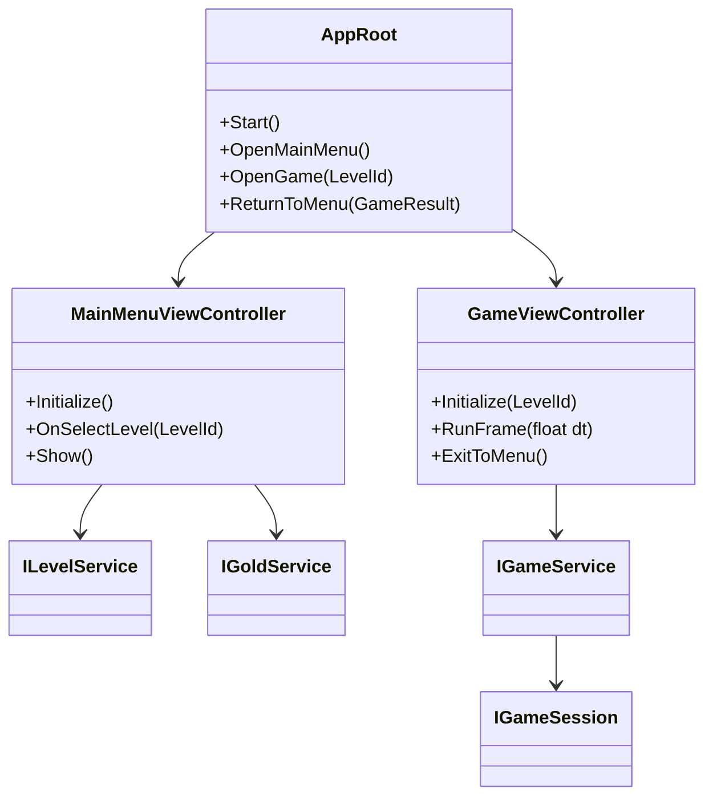
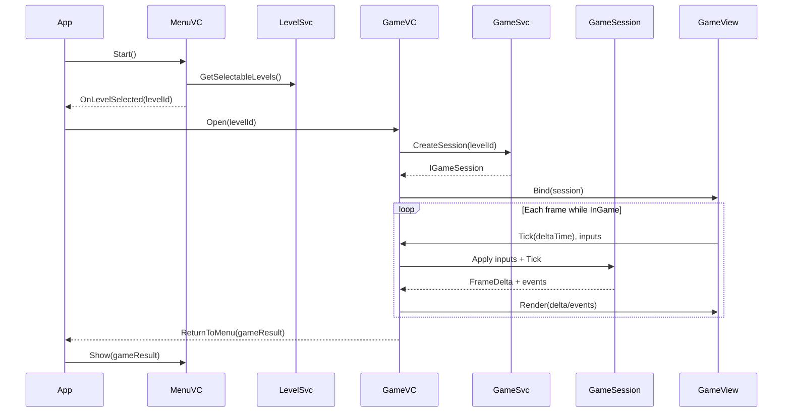

# Core Loop Research and Specs

Date: 2026-03-17
Scope: App-level game loop and screen/controller orchestration based on `Research/basic game loop.png`


Related documents:

1. `Research/Entities/Entity-Research-and-Specs.md`
2. `Research/Entities/Entity-Addressables-Specs.md`
3. `Research/Battle/Battle-Research-and-Specs.md`

## 1. Understanding from the Basic Loop Image

The diagram describes a simple but clean app flow:

1. App starts and opens `MainMenuViewController`.
2. `MainMenuViewController` shows `MainMenuView`.
3. Player selects a level in the menu.
4. `MainMenuViewController` creates/opens `GameViewController` with selected level context.
5. `GameViewController` shows `GameView`, handles gameplay input notifications, and creates `Game` via `GameService`.
6. On game exit/end, control returns to `MainMenuViewController`.
7. Services are IOC-managed:
   - Menu side uses `GoldService` and `LevelService`.
   - Game side uses `GameService`.

## 2. Core Principles for Core Loop

1. Controllers orchestrate flow; services provide business/domain capabilities.
2. Views stay passive: render data and forward UI events.
3. `GameView` drives `Tick(deltaTime)` and player input into domain `Game`.
4. `Game` remains pure C# authoritative simulation.
5. Scene/screen transitions must preserve clear ownership and disposal boundaries.
6. Navigation state should be explicit (menu, loading, in-game, summary, back-to-menu).
7. App loop must support pure C# harness mode (without Unity view stack).

## 3. Proposed Runtime States

1. `Boot`
2. `MainMenu`
3. `LoadingLevel`
4. `InGame`
5. `PostGame`
6. `ReturningToMenu`

Transition outline:

1. `Boot -> MainMenu`
2. `MainMenu -> LoadingLevel` (on level select)
3. `LoadingLevel -> InGame` (after level + game initialization)
4. `InGame -> PostGame` (win/lose/quit)
5. `PostGame -> ReturningToMenu -> MainMenu`

## 4. Ownership and Responsibility

### 4.1 App Layer

1. Initializes IOC container scopes.
2. Starts root navigation controller.
3. Handles top-level lifecycle events (pause/resume/quit).

### 4.2 Main Menu Controller

1. Resolves available levels via `ILevelService`.
2. Resolves progression/currency via `IGoldService`.
3. Presents selectable level entries to `MainMenuView`.
4. Requests game session start with selected level id.

### 4.3 Game Controller

1. Requests session creation via `IGameService`.
2. Creates/binds `GameView`.
3. Forwards `Tick`/input/hit reports from view to domain game.
4. Applies domain output deltas/events back to bound views.
5. Decides end-of-run handling and return payload to menu.

### 4.4 Services

1. `ILevelService`: level metadata, unlocked state, selection validation.
2. `IGoldService`: wallet/progression side data.
3. `IGameService`: creates and disposes `IGameSession` with selected level definition.

## 5. End-to-End Loop Flow

1. App boot initializes IOC and opens `MainMenuViewController`.
2. Menu controller loads level list/progression and renders menu.
3. Player chooses level; controller validates availability.
4. Game controller starts loading/setup phase.
5. `IGameService` creates pure C# game session from selected level definition.
6. Game view becomes active and starts sending `Tick(deltaTime)` + inputs.
7. Domain simulation updates and emits frame deltas/events.
8. Game controller applies outputs to view binders.
9. End condition reached (win/lose/quit).
10. Game controller returns run result to menu controller.
11. Menu refreshes progression/gold and shows updated state.

## 6. Sample UML

### 6.1 App and Controller Structure



### 6.2 Main Loop Sequence



## 7. Sample Interfaces (Draft)

```csharp
public interface IAppNavigator
{
    void OpenMainMenu();
    void OpenGame(LevelId levelId);
    void ReturnToMenu(GameResult result);
}

public interface IMainMenuController
{
    void Initialize();
    void Show();
    void OnSelectLevel(LevelId levelId);
}

public interface IGameViewController
{
    void Initialize(LevelId levelId);
    void Tick(float deltaTime);
    void HandleInput(GameInput input);
    void HandleEvent(GameEvent gameEvent);
    void ExitToMenu();
}

public interface IGameService
{
    IGameSession CreateSession(LevelId levelId);
}

public interface IGameSession : IDisposable
{
    AttackDecision TryAttack(TryAttackInput input);
    void Tick(float deltaTime);
    void SubmitInput(GameInput input);
    void SubmitEvent(GameEvent gameEvent);
    GameFrameDelta DrainFrameDelta();
}

public interface ILevelService
{
    IReadOnlyList<LevelSummary> GetSelectableLevels();
    bool IsUnlocked(LevelId levelId);
}

public interface IGoldService
{
    int GetCurrentGold();
    void ApplyRunResult(GameResult result);
}
```

## 8. Pure C# Compatibility Mode

1. Replace Unity controllers/views with a test harness runner.
2. Use `IGameService` to create session directly from baked level data.
3. Drive loop via scripted ticks and inputs.
4. Assert resulting model outputs and progression changes.
5. Keep `MainMenu` logic testable by mocking `ILevelService`/`IGoldService`.

## 9. Concerns and Things to Explore

1. Scope lifetime:
   - Single IOC scope for app + child scopes per game session?
2. Async loading:
   - Should `LoadingLevel` support cancellation/back action?
3. Error handling:
   - Fallback behavior when level content fails to load.
4. Tick policy:
   - Fixed simulation steps vs variable delta pass-through.
5. State restoration:
   - How to handle app pause/resume in `InGame`.
6. Session teardown:
   - Guarantee full disposal of game session and bound views on return to menu.
7. Result contract:
   - Define `GameResult` shape for rewards, stats, and reason for exit.
8. Metrics:
   - Where to log loop milestones (level start/end, duration, win/lose).

## 10. Suggested Next Iteration

1. Define concrete `GameResult`, `LevelSummary`, and `LevelId` value types.
2. Implement `AppRoot` state machine with explicit transitions.
3. Implement `MainMenuViewController` to `GameViewController` handoff contract.
4. Add first integration test for `Boot -> MainMenu -> InGame -> ReturnToMenu`.
5. Wire Addressables-based level load path from `Entity-Addressables-Specs`.
