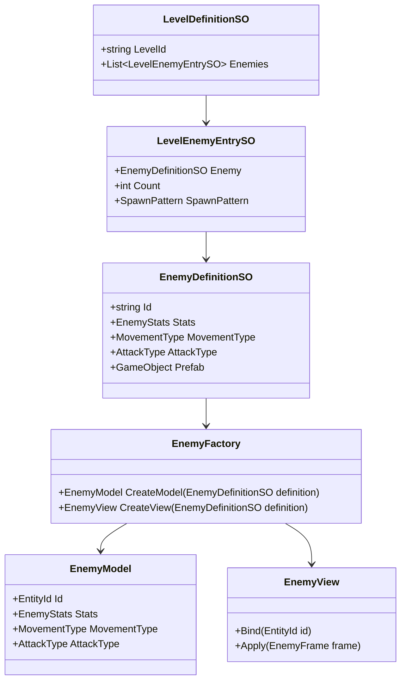
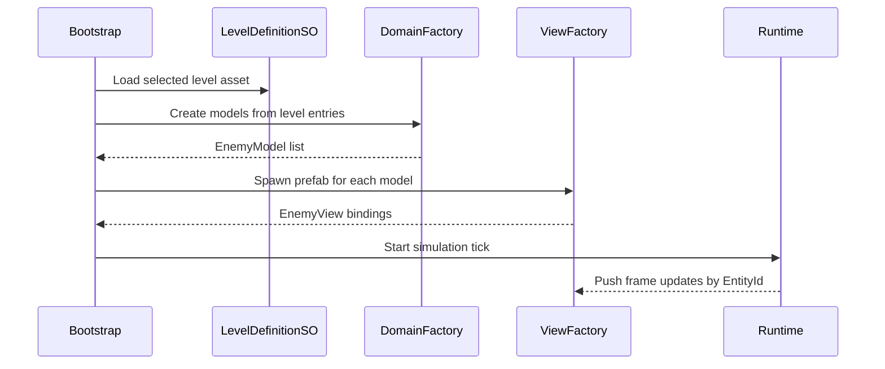

# Entity Research and Specs

Date: 2026-03-17
Scope: Entity authoring and runtime boundaries, based on `Research/Entities/Entity Definition.png`


## 1. Understanding from the Entity Image

The diagram suggests a three-part entity setup:

1. C# definition data contains gameplay-relevant fields like HP, Speed, Damage, MovementType, and AttackType.
2. A ScriptableObject is the authoring bridge. It stores a reference to the definition and to a prefab.
3. The prefab contains Unity/runtime behavior and visual setup, including movement behavior, attack behavior, projectile prefab, colliders, animations, and transform position.

Main interpretation:

1. Data needed by game rules belongs in C# definition.
2. Unity-specific, transient, and visual-only state belongs in prefab/runtime.
3. Movement/attack behavior assets in prefab should map to the core movement/attack type in the definition.

## 2. Core Principles

1. Keep gameplay truth in pure C# domain models, not in MonoBehaviours.
2. Use ScriptableObjects for authoring and linking, not as mutable runtime state.
3. Treat prefabs as delivery vehicles for visuals, colliders, effects, and Unity behaviors.
4. Enforce explicit mapping from authored data to runtime entities through factories.
5. Prevent drift by validating SO and prefab references at edit time.
6. Keep level composition declarative by referencing enemy definition SOs from a level SO.
7. Ensure domain simulation can run in tests without Unity scene/prefab loading.

## 3. Authoring Flow Proposal (SO-Driven)

Goal: a designer can drag `EnemyDefinitionSO` assets into `LevelDefinitionSO` fields and run the level.

### 3.1 Assets

1. `EnemyDefinitionSO`
2. `LevelDefinitionSO`
3. Enemy prefabs referenced by `EnemyDefinitionSO`

### 3.2 Recommended Authoring Data Shape

1. `EnemyDefinitionSO` holds immutable enemy authoring data:
   - Stable `EntityId`
   - Core stats/config values
   - Movement and attack type
   - Prefab reference
2. `LevelDefinitionSO` holds:
   - Level id/name
   - List of enemy entries that reference `EnemyDefinitionSO`
   - Spawn instructions per entry (count, points/areas, timing/waves)

### 3.3 Runtime Flow

1. Level bootstrap loads one `LevelDefinitionSO`.
2. Level data is converted to pure C# `LevelModel`.
3. For each enemy entry, a domain entity is created from enemy definition data.
4. View factory instantiates the referenced prefab and binds it to the domain entity id.
5. Runtime systems update domain state. View reads/apply state and plays Unity behaviors.

### 3.4 Validation Rules (Editor Time)

1. Every `EnemyDefinitionSO` must have a non-empty id and assigned prefab.
2. Prefab must provide required runtime components for movement/attack behavior contracts.
3. `LevelDefinitionSO` enemy list cannot contain null references.
4. Duplicate ids inside a level should be rejected or flagged.

## 4. Sample UML

### 4.1 Class View



### 4.2 Spawn Sequence



## 5. Sample Interfaces (Draft)

```csharp
public interface IEntityDefinition
{
    string Id { get; }
}

public interface IEnemyDefinition : IEntityDefinition
{
    EnemyStats Stats { get; }
    MovementType MovementType { get; }
    AttackType AttackType { get; }
}

public interface ILevelDefinition
{
    string LevelId { get; }
    IReadOnlyList<ILevelEnemyEntry> Enemies { get; }
}

public interface ILevelEnemyEntry
{
    IEnemyDefinition Enemy { get; }
    int Count { get; }
    SpawnPattern SpawnPattern { get; }
}

public interface IEnemyModelFactory
{
    EnemyModel Create(IEnemyDefinition definition);
}

public interface IEnemyViewFactory
{
    EnemyViewHandle Spawn(IEnemyDefinition definition, EntityId entityId);
}

public interface IEnemyBinder
{
    void Bind(EntityId entityId, EnemyViewHandle viewHandle);
}
```

Note: in Unity-specific assemblies, `IEnemyDefinition` may be backed by `EnemyDefinitionSO`, while domain assemblies consume the interface-only abstraction.

## 6. Concerns and Things to Explore

1. Identity strategy:
   - Should `Id` be human-readable, GUID-backed, or both?
2. Versioning:
   - How do we evolve enemy definitions without breaking existing level assets?
3. Shared vs level-local overrides:
   - Should level entries be allowed to override base stats from `EnemyDefinitionSO`?
4. Determinism:
   - How much of movement/attack behavior is data-driven versus MonoBehaviour-driven?
5. Validation ownership:
   - ScriptableObject `OnValidate`, custom editor validators, analyzer checks, or all three?
6. Addressables integration:
   - Should prefab references be direct, addressable keys, or both?
7. Runtime mutation:
   - Ensure buffs/debuffs mutate runtime model state only, never authoring assets.
8. Test approach:
   - Add tests for mapping (`SO -> domain model`) and for level composition integrity.
9. Save/load:
   - Confirm persistence stores `EntityId` and runtime deltas, not prefab instance details.
10. Performance:
   - Plan for pooling strategy tied to `EnemyDefinitionSO` + prefab identity.

## 7. Suggested Next Iteration

1. Decide id strategy and override policy.
2. Define a first concrete `EnemyDefinitionSO` and `LevelDefinitionSO` schema in code.
3. Add authoring validation tests for invalid references and duplicate ids.
4. Add one vertical-slice level using drag-and-drop enemy SO references.
5. Finalize and apply Addressables strategy from:
   - `Research/Entities/Entity-Addressables-Specs.md`
